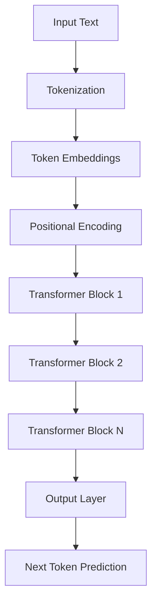
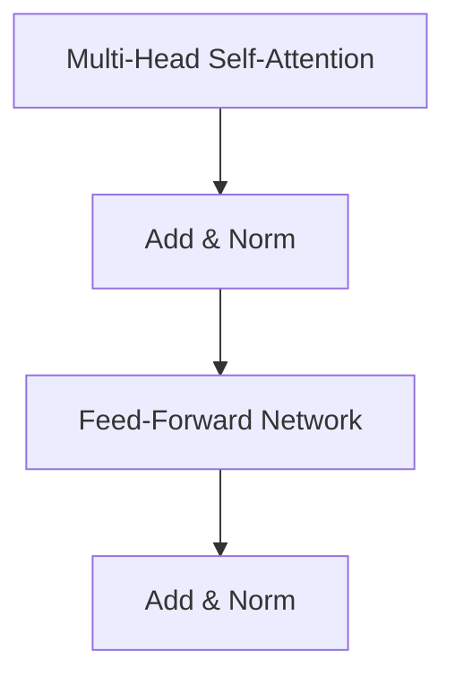

# Large Language Models (LLMs)

## Overview

This lecture notes provides an in-depth examination of Large Language Models (LLMs), covering their foundational principles, architectural design, complete training methodologies (pre-training and post-training), text generation mechanisms, and practical deployment considerations. The content addresses theoretical concepts, real-world implementation challenges, specific datasets, and critical insights for understanding how modern LLMs function in production environments.

***

## Core Concepts

### What are LLMs?

* **Definition**: AI models designed to understand and generate human-like text through statistical pattern learning from massive text corpora.

* **Foundation for**: Advanced applications including:

  * Autonomous agents
  * Coding platforms and programming assistants
  * Productivity tools
  * Conversational interfaces and chatbots

* **Core capability**: Processing and producing natural language by learning patterns, syntax, semantics, and implicit world knowledge from data.

### Training Philosophy

LLMs undergo a **two-stage training pipeline**:

1. **Pre-training**: Building foundational language understanding from internet-scale data
2. **Post-training**: Refining for specific tasks, conversational behavior, and alignment with human preferences

***

## Pre-training Stage

### Objective and Scope

* **Goal**: Train a base model on massive internet-scale datasets to acquire:

  * General language understanding
  * Implicit world knowledge
  * Syntactic and semantic patterns

* **Resource requirements**:

  * **Thousands of GPUs** operating in parallel
  * **Training duration**: Multiple months
  * **Cost**: Millions of dollars per training run
  * **Outcome**: A base model with broad language capabilities

### Data Preparation Pipeline

#### 1. Data Crawling

* **Primary source**: **Common Crawl** - a public repository of web-crawled data
* **Scale**: Terabytes to petabytes of raw text data
* **Coverage**: Diverse domains, languages, and content types from across the internet
* **Tools**: Web crawlers that systematically collect internet content

**Why Common Crawl needs extensive cleaning:**

* Contains **massive amounts of low-quality content**:

  * Spam websites
  * Duplicate pages
  * Machine-generated text
  * Inappropriate or harmful content

* **Raw Common Crawl is unusable** without significant processing

* Different cleaning approaches make different quality-cost trade-offs

#### 2. Data Cleaning

* **Removal targets**:

  * HTML tags and markup
  * Duplicate content
  * Low-quality or irrelevant text
  * Unsafe or harmful content

* **Quality assurance**: Multi-stage filtering mechanisms to ensure training data integrity

* **Major cleaned datasets**:

  **Common Crawl (C4)**:

- Raw web crawl data that serves as foundation for other datasets

- Requires extensive cleaning before use

  **Dolma**:

- Open corpus containing **3 trillion tokens** for language model pre-training research

- Extensively cleaned version of web crawl data

- Focuses on English words and subwords

- Designed for research transparency

  **RefinedWeb**:

- Popular large-scale dataset

- Applies sequence of filtering and cleaning steps to Common Crawl

- Provides detailed statistics on data scale and composition

- Well-documented cleaning methodology

  **FineWeb**:

- More recent dataset published by **Hugging Face**

- Openly available with transparent data cleaning pipeline

- Comprehensive documentation of all cleaning steps

- Key pipeline stages clearly defined for reproducibility

- Represents current best practices in data preparation

#### 3. Tokenization

* **Purpose**: Convert text into numerical sequences (tokens) that models can process

* **Process steps**:

  1. Text splitting into units
  2. Vocabulary building
  3. Mapping tokens to unique numerical IDs

* **Tokenization strategies**:

  * **Character-level**:

    * Smallest vocabulary size
    * Longest sequences
    * Rarely used in modern LLMs

  * **Word-level**:

    * Large vocabulary
    * Shorter sequences
    * Struggles with rare words

  * **Subword tokenization** (preferred):

    * Balanced trade-off between vocabulary and sequence length
    * Industry standard for modern LLMs

* **Preferred method**: **Byte Pair Encoding (BPE)**

  * Manages vocabulary size effectively
  * Handles rare words through subword decomposition
  * Optimizes sequence length
  * Most common approach for advanced LLMs

**Language-specific tokenization considerations:**

* **English**: Well-optimized, efficient tokenization

* **Other languages**: May require 2-3x more tokens for same content

* **Impact**:

  * Affects context window utilization
  * Influences inference costs
  * Can limit effective context for non-English languages

### Training Mechanics

**How models learn from text:**

* Models process **chunks of text** during training (not individual tokens)
* Each chunk contains multiple tokens in sequence
* The model learns to predict **every next token** within each chunk
* This is more efficient than processing one token at a time

**Example training sequence:**

* Given text: "The cat sat on the mat"

  * Model predicts "cat" after seeing "The"
  * Predicts "sat" after seeing "The cat"
  * Predicts "on" after seeing "The cat sat"
  * Continues for entire sequence

* Each prediction helps model learn language patterns

### Pre-training Outcome

* **Result**: A **base model** with broad language understanding

* **Base model behavior**:

  * Functions as a **completion engine**, not a conversational assistant
  * Given "The capital of France is", continues with "Paris, which is located..."
  * Does **not naturally respond to questions** like "What is the capital of France?"
  * **This is why post-training is essential** - transforms completion into conversation

* **Limitations**: Not yet optimized for:

  * Specific task performance
  * Conversational interaction
  * Following instructions
  * Safety alignment

***

## Model Architecture

### Neural Network Foundations

* **Structure**: Composed of stacked layers that learn input-to-output mappings
* **Definition**: A sequence of parameterized transformations
* **Learning mechanism**: Parameters (weights) adjusted during training to improve predictions

#### Key Layer Types

1. **Linear layers**: Perform linear transformations (matrix multiplications)
2. **Activation layers**: Introduce non-linearity (e.g., ReLU, GELU)
3. **Normalization layers**: Stabilize training (e.g., Layer Normalization)

### Transformer Architecture

* **Origin**: Introduced in the seminal paper **"Attention is All You Need"**
* **Revolution**: Transformed NLP by replacing recurrent architectures
* **Original use**: Sequence-to-sequence tasks (e.g., machine translation)
* **Core mechanism**: **Self-attention** for capturing contextual relationships

**Why self-attention is powerful:**

* Allows model to **weigh importance** of different tokens in context
* Can focus on relevant information **regardless of distance** in sequence
* Enables understanding of **long-range dependencies**
* **Example**: In "The cat, which was very fluffy and loved to play, sat", attention helps connect "cat" with "sat" despite intervening words

### Decoder-Only Transformers

* **Current standard**: Architecture underlying most modern LLMs

* **Design**: Optimized specifically for text generation tasks

* **Structure**: Stacked transformer blocks, each containing:

  * Multi-head self-attention mechanism
  * Feed-forward neural network
  * Residual connections
  * Layer normalization

______
##### LLM Architecture

##### Transformer Block:

### Scaling Laws and Model Capacity

* **Principle**: Model capabilities scale with parameter count

* **Parameter components**:

  * Number of layers (depth)
  * Embedding dimensions (width)
  * Number of attention heads

* **Hyperparameter differences**: Key differences between models lie in hyperparameters like number of layers and vector dimensions

* **Cost-capacity trade-off**:

  * Model capacity increases with parameters
  * Computational costs rise proportionally
  * Memory requirements grow substantially

* **Notable examples**:

  * **GPT-3**: 175 billion parameters
  * **Llama 3**: 405 billion parameters

* **Scaling reality**:

  * Larger models perform better on complex tasks

  * **Improvements are not linear** - diminishing returns

  * Doubling parameters doesn't double performance

  * **Practical limits** exist:

    * Computational cost grows faster than performance gains
    * Memory requirements become prohibitive
    * Training time increases substantially

***

## Training Process (Pre-training)

### Training Objective

* **Goal**: Tune model parameters (weights) to accurately predict the next token in a sequence
* **Paradigm**: Self-supervised learning through next-token prediction
* **No labeled data required**: Model learns from raw text structure

### Training Methodology

1. **Data sampling**: Select text sequences (chunks) from training corpus
2. **Forward pass**: Process input through the LLM
3. **Loss calculation**: Compute **cross-entropy loss** between predicted and actual next tokens
4. **Optimization**: Update parameters using optimizers (e.g., **Adam**, **AdamW**)
5. **Iteration**: Repeat across millions of training steps over months

### Computational Challenges

* **Hardware requirements**:

  * Thousands of GPUs operating in parallel
  * Terabytes of memory (RAM and VRAM)
  * Terabytes of storage for model checkpoints

* **Distributed training techniques**:

  * **Data parallelism**: Different GPUs process different data batches
  * **Model parallelism**: Model split across multiple GPUs
  * **Pipeline parallelism**: Different layers on different GPUs
  * **Gradient accumulation**: Simulate larger batches

* **Infrastructure complexity**:

  * Requires sophisticated orchestration
  * Fault tolerance mechanisms essential
  * Checkpoint management critical

***

## Post-Training Stage

After pre-training produces a base model, post-training refines it for practical use through two critical sub-stages:

### 1. Supervised Fine-Tuning (SFT)

* **Purpose**: Adapts the base model to follow instructions and answer questions

* **Method**:

  * Uses curated **prompt-response pairs**
  * Model learns to map user instructions to appropriate responses
  * Transforms general language model into instruction-following assistant

* **Training process**:

  * Similar to pre-training but with structured conversational data
  * Model learns conversational patterns and instruction-following behavior
  * Typically requires far less data than pre-training

* **Outcome**: Model becomes capable of:

  * Understanding user intent
  * Following specific instructions
  * Providing structured responses
  * Engaging in conversational interactions

* **Challenge**: Requires high-quality, diverse training data

### 2. Reinforcement Learning from Human Feedback (RLHF)

* **Purpose**: Refines the model to align with human preferences for helpfulness, accuracy, and safety

* **Two-step process**:

  **Step 1: Train a Reward Model**

- Collect human rankings of model responses

- Present same prompt to model multiple times

- Humans rank outputs by quality, helpfulness, safety

- Train a separate model to predict human preferences

- Reward model learns to score outputs based on quality

  **Step 2: Optimize with Reinforcement Learning**

- Use **Proximal Policy Optimization (PPO)** or similar RL algorithms

- LLM generates responses and receives scores from reward model

- Model parameters updated to maximize reward scores

- Iterative refinement aligns outputs with human values

- Process continues until desired alignment achieved

* **Benefits**:

  * Improves response quality and relevance
  * Reduces harmful or biased outputs
  * Enhances user satisfaction
  * Aligns model behavior with human values

* **Challenges**:

  * **Complex and time-consuming process**
  * **Reward model bias**: The reward model itself can introduce biases
  * **Alignment challenges**: Ensuring consistent alignment across diverse tasks and contexts
  * **Human preference inconsistency**: Different annotators may rank same responses differently
  * **Cultural differences**: What's considered helpful or appropriate varies by culture
  * **Reward hacking**: Model may exploit reward model weaknesses rather than truly improving
  * Requires significant human annotation effort and cost

***

## Text Generation (Inference)

### Generation Process

* **Mechanism**: Iterative, **autoregressive** token-by-token generation

* **Feedback loop**: Generated tokens are fed back as input for subsequent predictions

* **Termination**: Continues until:

  * End-of-sequence token generated
  * Maximum length limit reached
  * Custom stopping criteria met

**Why autoregressive matters:**

* Each generated token becomes part of the context for the next token

* This creates **coherent long-form text**

* **Implications**:

  * Errors can compound over long sequences
  * Context window eventually fills up
  * Earlier tokens influence all subsequent generation
  * Models don't just generate single responses - they can continue indefinitely

### Decoding Algorithms

#### Deterministic Methods

1. **Greedy Search**

   * **Strategy**: Always select token with highest probability
   * **Advantage**: Fast and simple
   * **Limitation**: Can produce repetitive or suboptimal outputs
   * **Use case**: Quick prototyping, not recommended for production

2. **Beam Search**

   * **Strategy**: Maintain top-k candidate sequences (beams)
   * **Advantage**: Explores multiple paths simultaneously
   * **Limitation**: Still prone to repetition and lacks diversity
   * **Use case**: Structured tasks like translation, but limited for open-ended generation

#### Stochastic Methods

1. **Multinomial Sampling**

   * **Strategy**: Sample tokens based on their probability distribution
   * **Advantage**: Introduces randomness and diversity
   * **Control**: **Temperature parameter** adjusts randomness
   * **Limitation**: Can produce incorrect outputs

2. **Top-K Sampling**

   * **Strategy**: Sample only from the k most probable tokens
   * **Advantage**: Balances diversity with quality
   * **Parameter**: k controls vocabulary restriction
   * **Limitation**: Fixed k value has inherent limitations
   * **Issue**: Same k may be too restrictive or too permissive depending on context

3. **Top-P (Nucleus) Sampling** ⭐

   * **Strategy**: Sample from tokens whose cumulative probability exceeds threshold p
   * **Advantage**: Dynamic vocabulary size based on probability distribution
   * **Flexibility**: Adapts to prediction confidence
   * **Industry standard**: **Most used and recommended method**
   * **Why preferred**: Balances quality, diversity, and coherence effectively
   * **Typical values**: p = 0.9 or 0.95 for most applications

### Temperature Parameter (Critical Control)

* **Function**: Controls randomness in probability distribution
* **How it works**: Scales logits before applying softmax

**Temperature settings:**

* **Low temperature** (e.g., 0.1-0.5):

  * Makes high-probability tokens even more likely
  * Produces more deterministic, focused outputs
  * Less creative, more predictable
  * **Use cases**: Factual questions, code generation, structured tasks

* **Temperature = 1.0**:

  * Uses original probability distribution
  * Balanced approach
  * Default for many applications

* **High temperature** (e.g., 1.5-2.0):

  * Flattens probability distribution
  * Gives lower-probability tokens more chance
  * More creative but potentially less coherent
  * **Use cases**: Creative writing, brainstorming, diverse outputs

* **Application**: Used with all stochastic sampling methods (multinomial, top-k, top-p)

***

## Real-World Applications

### Production Use Cases

* **Conversational AI**:

  * Chatbots and virtual assistants
  * Customer support automation
  * Interactive help systems

* **Code generation**:

  * Programming assistants (e.g., GitHub Copilot)
  * Code completion and suggestion
  * Debugging assistance
  * Code explanation and documentation

* **Content creation**:

  * Writing assistance and editing
  * Summarization of documents
  * Translation services
  * Content generation for marketing

* **Knowledge work**:

  * Research assistance
  * Document analysis and extraction
  * Data interpretation
  * Report generation

* **Productivity tools**:

  * Email drafting and responses
  * Meeting summarization
  * Task automation
  * Workflow optimization

### Industry Adoption

* **Widespread deployment**: LLMs power numerous commercial applications

* **Integration patterns**:

  * API-based services
  * Embedded models in applications
  * Fine-tuned variants for specific domains

* **Scaling considerations**: Balancing performance, cost, and latency requirements

***

## Challenges and Pitfalls

### Pre-Training Challenges

* **Computational cost**: Multi-million dollar training runs
* **Data quality**: Ensuring clean, diverse, and safe training data
* **Infrastructure complexity**: Managing distributed systems at scale
* **Reproducibility**: Difficulty replicating exact training conditions
* **Data sourcing**: Obtaining sufficient high-quality data from Common Crawl and similar sources
* **Time investment**: Months of continuous training required

### Post-Training Challenges

* **SFT data quality**: Requires high-quality curated prompt-response pairs
* **Data curation cost**: Expensive to create diverse, high-quality instruction datasets
* **RLHF complexity**: Time-consuming and technically challenging process
* **Reward model bias**: The reward model itself can introduce biases
* **Alignment challenges**: Ensuring consistent alignment with human preferences across diverse tasks
* **Human preference inconsistency**: Different annotators may rank same responses differently
* **Cultural differences**: What's helpful or appropriate varies by culture
* **Reward hacking**: Models may exploit reward model weaknesses
* **Human annotation cost**: Expensive and time-intensive to collect feedback
* **Subjectivity**: Human preferences are inherently subjective and context-dependent

### Generation Challenges

* **Repetition**: Deterministic methods prone to repetitive outputs
* **Hallucination**: Models may generate plausible but factually incorrect information
* **Context limitations**: Fixed context window restricts long-form understanding
* **Bias**: Models inherit biases present in training data
* **Sampling trade-offs**: Balancing creativity and accuracy in stochastic methods
* **Error compounding**: Autoregressive generation means early errors affect all subsequent tokens
* **Stopping control**: Need proper mechanisms to prevent infinite generation

### Deployment Challenges

* **Inference cost**: High computational requirements for large models

  * **Each token requires full forward pass** through entire model
  * For 100-token response, model runs 100 times
  * Cost scales with tokens × model size

* **Memory bandwidth bottleneck**:

  * Often the limiting factor, not raw computation
  * Larger models = more memory access = slower generation
  * **Model size directly impacts serving cost**

* **Latency**: Token-by-token generation can be slow for real-time applications

* **Memory footprint**: Large models require substantial GPU memory

* **Safety**: Ensuring appropriate outputs in production environments

* **Scalability**: Serving models to millions of users simultaneously

* **Cost management**: Balancing quality with operational expenses

***

## Key Insights

### Training and Architecture

* **Two-stage training** (pre-training + post-training) is fundamental to LLM development
* **Base models are completion engines**, not conversational assistants - post-training enables conversation
* **Models train on chunks**, predicting all tokens within each chunk for efficiency
* **Decoder-only transformers** are the dominant architecture for modern text generation
* **Self-attention enables long-range dependencies** regardless of token distance in sequence

### Scaling and Performance

* **Scaling laws** demonstrate that larger models generally perform better on complex tasks
* **Scaling improvements diminish** as models grow - not linear returns
* **Hyperparameter tuning** significantly affects model capacity and computational costs
* **Cost-capacity trade-off** is fundamental - more parameters = better performance but higher costs

### Data and Tokenization

* **Data cleaning is critical**: Datasets like **Dolma**, **FineWeb**, and **RefinedWeb** demonstrate importance of systematic cleaning pipelines
* **Common Crawl requires extensive cleaning** - raw data is unusable
* **Subword tokenization** (BPE) provides optimal balance between vocabulary size and sequence length
* **Tokenization efficiency varies by language**, affecting context window and costs

### Generation and Inference

* **Top-P (Nucleus) sampling** is the most used and recommended decoding method
* **Temperature parameter** is critical for controlling output randomness and creativity
* **Autoregressive generation** means each token influences all subsequent tokens
* **Memory bandwidth** is often the inference bottleneck, not raw computation
* **Stochastic decoding** (Top-K, Top-P) produces more diverse and natural outputs than deterministic methods

### Post-Training and Alignment

* **Post-training is essential** - SFT and RLHF transform base models into useful assistants
* **RLHF alignment** is complex but necessary for safe, helpful AI systems
* **Human preference inconsistency** makes RLHF challenging and introduces noise
* **Reward hacking** is a real risk during RL optimization

### Cost and Resources

* **Training cost** is a major barrier, requiring millions of dollars and months of computation
* **Data quality** directly impacts model performance and safety
* **Distributed training** is essential for training models at scale
* **Inference costs** scale with model size and token count

***

## Quick Recall / Implementation Checklist

### Data Preparation

* \[ ] Use established cleaned datasets (Dolma, FineWeb, RefinedWeb) or implement comprehensive cleaning pipeline
* \[ ] Confirm tokenization strategy matches language domain and use case (prefer BPE)
* \[ ] Validate data cleaning pipeline removes duplicates, HTML, and unsafe content
* \[ ] Check for data bias during pre-training and post-training phases
* \[ ] Account for **language-specific tokenization** efficiency (non-English may use 2-3x more tokens)
* \[ ] Remember **Common Crawl requires extensive cleaning** before use

### Training

* \[ ] Plan for massive computational resources (thousands of GPUs, months of training)
* \[ ] Budget appropriately for training costs (millions of dollars)
* \[ ] Implement distributed training techniques for large-scale models
* \[ ] Validate cross-entropy loss convergence during training
* \[ ] Ensure adequate memory and storage for model checkpoints
* \[ ] Understand models train on **chunks**, predicting all tokens within each chunk
* \[ ] Recognize **scaling has diminishing returns** - plan accordingly

### Post-Training

* \[ ] Curate high-quality prompt-response pairs for SFT
* \[ ] Implement RLHF pipeline with reward model training
* \[ ] Monitor for **reward model bias** during RLHF
* \[ ] Test alignment across diverse tasks and contexts
* \[ ] Prepare for **human preference inconsistency** in annotations
* \[ ] Monitor for **reward hacking** during RL optimization
* \[ ] Consider **cultural differences** in preference collection
* \[ ] Collect diverse human feedback to reduce preference inconsistency

### Text Generation

* \[ ] Use **Top-P (Nucleus) sampling** as the primary decoding method (most recommended)
* \[ ] Set appropriate **temperature** based on use case (lower for factual, higher for creative)
* \[ ] Avoid greedy search for production applications
* \[ ] Test multiple decoding strategies to find optimal quality-diversity balance
* \[ ] Implement proper **stopping criteria** to prevent infinite generation
* \[ ] Monitor for hallucination likelihood in production deployments
* \[ ] Implement proper context window management for long documents
* \[ ] Remember base models are **completion engines** - post-training enables conversation
* \[ ] Account for **autoregressive compounding** effects in long generations

### Deployment and Performance

* \[ ] Consider model size vs. inference cost trade-offs for production deployment
* \[ ] Implement safety filters and content moderation for user-facing applications
* \[ ] Monitor token generation speed and optimize for latency-sensitive applications
* \[ ] Plan inference costs based on **tokens × model size**
* \[ ] Optimize for **memory bandwidth**, not just computation
* \[ ] Remember each token requires **full model forward pass**
* \[ ] Plan for scalability to handle concurrent users
* \[ ] Establish monitoring systems for output quality and safety
* \[ ] Budget for ongoing inference costs in production

### Architecture Understanding

* \[ ] Understand **self-attention enables long-range dependencies** regardless of distance
* \[ ] Recognize **hyperparameter differences** affect capacity and cost
* \[ ] Plan for **cost-capacity trade-offs** when selecting model size
