# LLM Foundations

## Overview

This lecture notes provides a comprehensive foundation in Large Language Models (LLMs), covering the complete lifecycle from data preparation through training to deployment. The focus is on understanding how modern chatbot services like ChatGPT, Claude, Gemini, Grok, and Meta.ai are built, trained, and deployed in production systems. The lecture emphasizes both theoretical concepts and practical demonstrations, with particular attention to the two-stage training process: pre-training and post-training.

## Core Concepts

### What is an LLM?

* **Definition**: An AI model that can understand and generate text
* When trained correctly, LLMs can:
  * Answer questions in natural conversation
  * Handle follow-up questions
  * Engage in meaningful dialogue
  * Generate contextually relevant continuations

### Major LLM Providers and Chatbots

* **ChatGPT** by OpenAI - First widely available public chatbot
* **Claude** by Anthropic
* **Gemini** by Google
* **Grok** by xAI
* **Meta.ai** by Meta

**Key observation from live demonstration**: When asked "Where is Paris?", different LLMs produce different responses in tone, structure, and detail, though all are accurate. This demonstrates that:
* LLMs differ in output quality and style
* More complex questions reveal greater capability differences
* Model rankings change as companies release more powerful versions

### Two-Stage Training Architecture

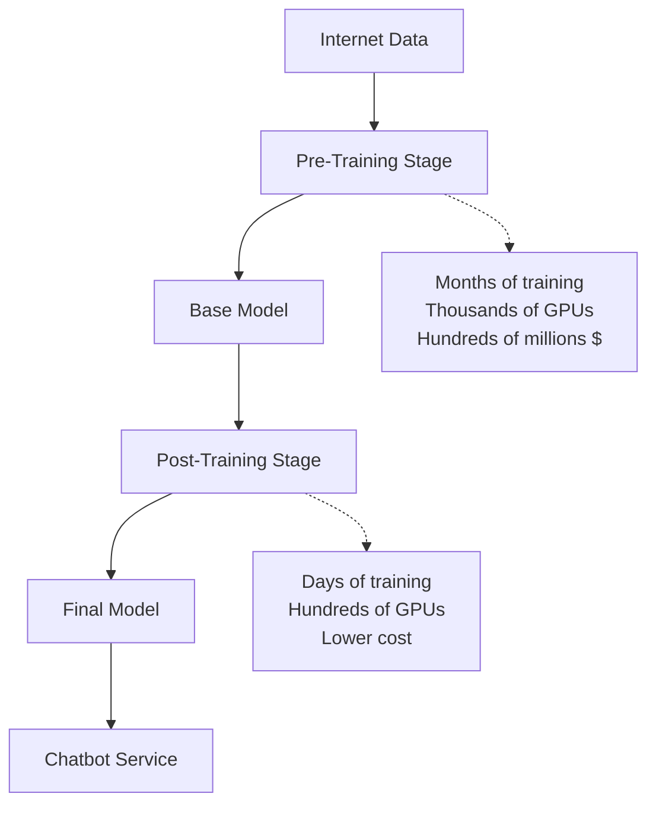

**Stage 1: Pre-Training**
* Train model on Internet data using next token prediction
* Extremely expensive: requires thousands of GPUs, months of training
* Cost: Hundreds of millions of dollars
* Output: **Base model** with implicit world knowledge
* Only well-funded startups and large companies can afford this stage

**Stage 2: Post-Training**
* Continue training base model on specialized post-training data
* Less expensive: requires hundreds of GPUs, days of training
* Cost: Significantly cheaper than pre-training
* Output: **Final model** ready for deployment

**Training Cost Reality** (from Stanford report):
* GPT-3 (175B parameters): ~$10 million
* GPT-4 and Gemini Ultra: Hundreds of millions of dollars
* Industry dominance: Most LLMs come from large tech companies with substantial funding

## Pre-Training Stage

### Data Preparation: Three Main Steps

#### Step 1: Crawling the Internet

**What is web crawling?**
* Software that starts from seed URLs
* Extracts content from each page
* Identifies outgoing links
* Recursively visits discovered links
* Continues until majority of Internet is covered

**Simple Web Crawler Logic** (Python demonstration):

```python
class SimpleWebCrawler:
    def __init__(self, base_url):
        self.base_url = base_url
        self.visited = set()  # Track visited URLs

    def crawl(self):
        to_visit = [self.base_url]  # Queue of URLs to explore

        while to_visit:
            url = to_visit.pop(0)
            if url in self.visited:
                continue

            # Get HTML content
            response = requests.get(url)
            html_content = response.text

            # Extract links using BeautifulSoup
            soup = BeautifulSoup(html_content, 'html.parser')
            for link in soup.find_all('a'):
                full_url = build_full_url(link['href'])
                to_visit.append(full_url)

            self.visited.add(url)
```

**Key components**:
* `visited` set: Tracks already-explored URLs
* `to_visit` list: Queue of discovered but unexplored URLs
* Loop continues until all reachable URLs are processed

**Two Approaches to Web Crawling**:

1. **Crawl Yourself** (preferred by large companies)
   * OpenAI and Anthropic both perform their own crawling
   * Provides maximum flexibility
   * Example: GPT-2 paper states "we created a new web script which emphasizes document quality"
   * Anthropic's website confirms: "Yes, we do crawl the web"

2. **Use Public Repositories** (preferred by smaller teams/startups)
   * **Common Crawl**: Nonprofit providing free web archives
   * Crawls web since 2008
   * Statistics:
     * ~2.7 billion web pages per crawl
     * 200-400 terabytes of HTML content per crawl
     * New crawl released every 1-2 months
   * Enables faster iteration for research and startups

#### Step 2: Data Cleaning

**Raw HTML Issues**:
* Contains many irrelevant tags, markdowns, attributes
* Most tags like `<html>`, `<head>`, `<div>` are not useful for LLM training
* Goal: Extract only meaningful text content (within `<h1>`, `<p>`, etc.)

**Additional Cleaning Requirements**:
* **Deduplication**: Remove duplicated content across the Internet
  * Same news appears on multiple websites
  * Prevents model from memorizing repeated content
  * Ensures model learns concepts, not specific text sequences
* **Content filtering**: Remove unsafe or unwanted content
* **Quality filtering**: Ensure only useful data remains

**Major Clean Datasets**:

1. **C4 (Colossal Clean Crawled Corpus)** by Google
   * Clean version of Common Crawl
   * 305 GB English data (cleaned version)
   * 2.3 TB uncleaned version
   * Format: Table with `text` and `url` columns
   * Widely used in early LLM development

2. **Dolma** (more recent)
   * Open corpus of 3 trillion tokens
   * Sources: Common Crawl, GitHub, Reddit, Wikipedia, others
   * Multiple filtering steps: quality filtering, content filtering
   * Paper provides detailed pipeline documentation

3. **RefinedWeb**
   * Another popular cleaned dataset
   * Focuses on high-quality web text
   * Similar multi-stage filtering approach

4. **FineWeb** by Hugging Face (most recent, recommended)
   * Openly available and well-documented
   * **Detailed cleaning pipeline**:

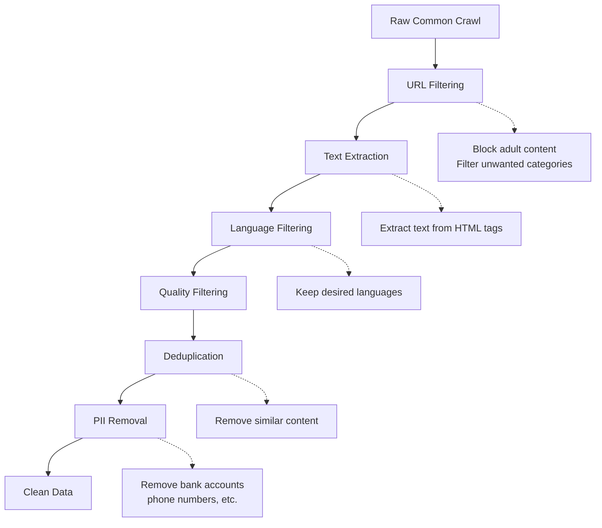

**FineWeb Statistics**:
* 44 terabytes disk space
* ~15 trillion tokens (words/subwords)
* Data format: Table with `text` and `url` columns
* Example content: Random text from diverse domains ("Did you know...", "Five reasons I love Boston...")

**Key Principle**: Cleaning pipelines remove redundancy but preserve unique content and domain diversity

#### Step 3: Tokenization

**Purpose**: Convert raw clean text to sequence of discrete numbers
* Machine learning models require numerical inputs, not text
* Tokenization bridges text and numerical representation

**Two Phases of Tokenization**:

**Phase 1: Training Phase**

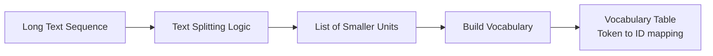

* **Text Splitting**: Apply algorithm to break text into smaller units (tokens)
  * Example: "Machine learning. ML is a subfield of artificial intelligence." becomes ["machine", "learning", ".", "ML", "is", "a", "subfield", "of", "artificial", "intelligence", "."]
* **Build Vocabulary**: Find all unique tokens and assign IDs
  * Example vocabulary: {a: 0, about: 1, after: 2, all: 3, also: 4, ...}
  * Vocabulary size varies based on splitting algorithm (can be 50K-270K+ tokens)

**Phase 2: Inference Phase**

* **Encoding** (text to numbers):
  * Apply same text splitting logic
  * Replace each token with its vocabulary ID
  * Example: "Tell me a joke" becomes [10512, 502, 257, 9707]

* **Decoding** (numbers to text):
  * Use inverse vocabulary table (ID to token)
  * Replace each ID with corresponding token
  * Apply inverse of text splitting to reconstruct text

### Tokenization Algorithms: Three Categories

#### 1. Word-Level Tokenization

**Approach**: Split text by whitespaces to get individual words

**Example**: "It's perfectly fine" becomes ["It's", "perfectly", "fine"]

**Characteristics**:
* Each word gets own token ID
* Vocabulary can be 100K-270K+ tokens
* Large vocabulary because Internet has many unique words

**Limitation**:
* **Huge vocabulary size** makes training expensive
* Must learn associations for hundreds of thousands of tokens
* Not used in modern LLMs

#### 2. Character-Level Tokenization

**Approach**: Split text into individual characters

**Example**: "perfectly fine" becomes ["p", "e", "r", "f", "e", "c", "t", "l", "y", " ", "f", "i", "n", "e"]

**Characteristics**:
* Very small vocabulary (~105 tokens: lowercase, uppercase, punctuation)
* Low token IDs (typically single or double digits)

**Limitation**:
* **Long sequence of numbers** after tokenization
* Model must learn dependencies across many tokens
* Computationally expensive during training
* Not used in modern LLMs

#### 3. Subword-Level Tokenization (Modern Standard)

**Key Insight**: Balance between word-level and character-level
* Tokens are **larger than characters** but **smaller than words**
* Example: "perfectly fine" becomes ["perfect", "ly", "fine"]

**Advantages**:
* Manageable vocabulary size
* Reasonable sequence length
* Best trade-off for efficiency and effectiveness

**Most Popular Algorithm: Byte Pair Encoding (BPE)**

**BPE Algorithm**:
1. Start with character-level tokens
2. Iteratively merge most frequent pairs
3. Create new tokens from frequent pairs
4. Continue until vocabulary reaches target size (e.g., 50K tokens)

**Example of BPE Process**:
* Initial: Individual characters as tokens
* Find most frequent pair (e.g., "U" + "G" appears often)
* Create new token "UG"
* Continue merging until vocabulary size limit reached

**BPE Usage in Modern LLMs**:
* GPT-2 paper: Uses BPE as tokenizer
* Llama 3 paper: "The tokenizer is a BPE model"
* Industry standard for advanced LLMs

**Vocabulary Size Comparison**:
* Character-level: ~105 tokens
* Subword-level: 50K-200K tokens (typical range)
* Word-level: 270K+ tokens (potentially millions with multiple languages)

**Real Example - Token Distribution**:
* Common English words: Single tokens ("the", "of", "home")
* Common suffixes: Single tokens ("ing", "ed", "able")
* Uncommon words: Multiple tokens
* Example: "walking" = "walk" + "ing"

### Practical Tokenization Tools

#### TikToken Library (by OpenAI)

**Features**:
* Fast BPE tokenizer (3-6x faster than alternatives)
* Open source and easy to use
* Pre-trained tokenizers available for GPT models

**Code demonstration**:

```python
import tiktoken

# Load pre-trained tokenizer for GPT-3.5
tokenizer = tiktoken.encoding_for_model("gpt-3.5-turbo")

# Encode text to token IDs
text = "I love machine learning!"
token_ids = tokenizer.encode(text)
# Output: [40, 3021, 5780, 6975, 0]

# Decode token IDs back to text
decoded_text = tokenizer.decode(token_ids)
# Output: "I love machine learning!"

# Check vocabulary size
vocab_size = tokenizer.n_vocab
# Output: 100277 tokens

# Try different model tokenizer
tokenizer_gpt4 = tiktoken.encoding_for_model("gpt-4o")
# Uses: o200k_base encoding
# Vocabulary: 200,019 tokens
```

**Key Observations**:
* Different models use different tokenizers
* Larger vocabularies in newer models (GPT-4: 200K vs GPT-3.5: 100K)
* Larger vocabulary = more efficient tokenization

#### TikTokenizer Website (Visualization Tool)

**Purpose**: Visualize how text gets tokenized

**Example Session**:
* Input: "I love machine learning!"
* Output: 5 tokens = [" I", " love", " machine", " learning", "!"]
* Each token shows its ID from vocabulary

**Interesting Cases**:
* "perfectly" (correct spelling) = 1 token
* "perfectely" (misspelling) = 3 tokens ["perfect", "el", "y"]
* Common sequences get single tokens
* Rare/random sequences split into smaller units

**Available Tokenizers**:
* Multiple pre-trained tokenizers to test
* Can compare different encoding schemes
* Useful for understanding token efficiency

### Model Architecture

#### Neural Networks: Foundation Concepts

**Goal of Machine Learning Models**: Learn mapping from input X to output Y

**Three Example Domains**:

1. **House Price Prediction**
   * Input X: Location, bedrooms, house size (converted to numbers)
   * Output Y: Price (single number)
   * Goal: Learn X to Y mapping

2. **Email Spam Classification**
   * Input X: Sender, content, subject (converted to numbers)
   * Output Y: Spam (1) or Not Spam (0)
   * Goal: Classify emails based on features

3. **Tumor Detection**
   * Input X: Image pixels (numbers)
   * Output Y: Location coordinates (4 numbers: top-left x,y and bottom-right x,y)
   * Goal: Detect and locate tumors

**Neural Network Definition**: Sequence of parameterized transformations that maps input to output

**Conceptual Flow**:

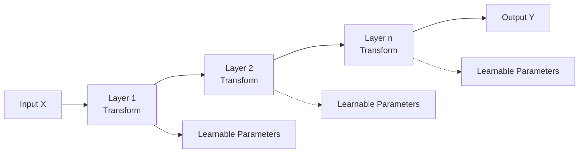

* Each layer transforms its input using learnable parameters (weights)
* Parameters are learned during training
* Multiple layers stack to create deep transformations

#### Common Neural Network Layers

**1. Linear Layer (Fundamental Building Block)**

**Mathematical Definition**: Y = W × X + b
* W: Weight matrix (learnable parameters)
* X: Input vector
* b: Bias vector (learnable parameter)
* Y: Output vector

**Example**:
* Input X = [0.1, 0.5, 0.3, 0.8] (4 numbers)
* Output Y = single number (0.6)
* Weight matrix W shape: 1 × 4 (one output, four inputs)
* Bias b shape: 1 (one output)

**Visualization as Neural Network**:

```
Input Layer (4 neurons)    Output Layer (1 neuron)
    O (0.1) ---w11--->
    O (0.5) ---w12--->     O (0.6)
    O (0.3) ---w13--->
    O (0.8) ---w14--->
```

* Circles = neurons
* Lines = connections with weights
* Term "neural network" comes from neuron-connection metaphor

**Generalizing to Multiple Outputs**:
* More output neurons = more rows in weight matrix
* 2 outputs, 4 inputs = weight matrix shape 2 × 4
* More connections = more parameters to learn

**Key Insight**: Linear layer is just a mathematical expression (matrix multiplication + addition)

**2. Other Layer Types** (mentioned for context):
* **Convolutional layers**: Better for spatial inputs (images)
* **Activation layers**: Introduce non-linearity
* **Attention layers**: Focus on relevant parts of input
* Each layer type has different transformation formula
* All layers share core purpose: transform input to output

**Neural Network as Composition**:

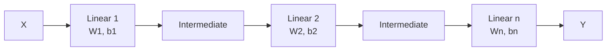

* Entire network = single mathematical expression
* Output Y computed from input X using all layer weights
* Training adjusts weights to learn desired X to Y mapping

#### Transformer Architecture

**Historical Context**: In 2017, Google published "Attention is All You Need"
* Introduced **Transformer architecture**
* Unique way of combining existing layers
* Initially designed for machine translation

**Transformer Structure**:

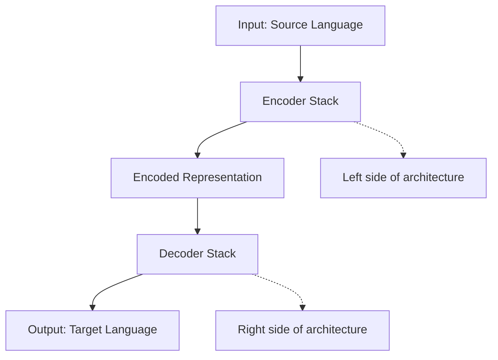

* **Encoder**: Processes source language text
* **Decoder**: Generates target language text
* Both composed of stacked layers with attention mechanisms

**Key Innovation**: Specific way of stacking layers works extremely well for text tasks

**Transformer as Mathematical Expression**:
* Like any neural network, entire transformer = single mathematical expression
* Complex but computable formula from inputs to outputs
* All intermediate computations use learnable parameters

**Recommended Resource**: Jay Alamar's "The Illustrated Transformer"
* Visual explanations of all components
* Detailed breakdown of encoder and decoder
* Shows data flow from source to target language

#### Decoder-Only Transformer (Modern LLM Architecture)

**Key Discovery**: Keeping only decoder part (right side) is powerful for text generation

**Why Decoder-Only?**
* **Text generation** is core LLM capability
* Decoder specializes in generating sequential output
* Encoder not needed when task is pure generation (not translation)

**Decoder-Only Structure**:

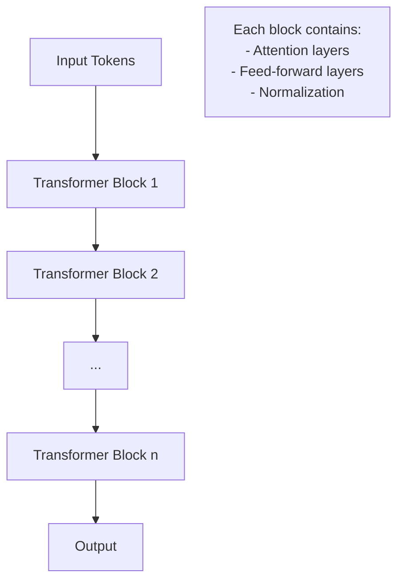

* Multiple transformer blocks stacked (n times)
* Each block = attention + feed-forward layers
* Blocks are identical in structure, different in learned parameters

**Critical Fact**: **All modern LLMs use decoder-only transformer architecture**
* LLM = decoder-only transformer trained on Internet data
* Industry standard across all major models

**What Differs Between LLMs**: Hyperparameters

**GPT-2 Model Variations** (OpenAI):

| Model | Layers (n) | Model Dimension | Parameters |
|-------|-----------|----------------|------------|
| Small | 12 | 768 | 117M |
| Medium | 24 | 1024 | 345M |
| Large | 36 | 1280 | 762M |
| XL | 48 | 1600 | 1.5B |

* **Layers (n)**: Number of stacked transformer blocks
* **Model dimension**: Size of internal vectors
* More layers + larger dimension = more parameters

**GPT-3 Model Variations** (OpenAI):

| Model | Layers | Model Dimension | Parameters |
|-------|--------|----------------|------------|
| Small | 12 | 768 | 125M |
| ... | ... | ... | ... |
| Largest | 96 | 12,288 | 175B |

* **Scaling trend**: Each generation increases model size
* GPT-3 largest: 175 billion parameters
* Requires significant engineering to train and serve

**Llama 3 Model Variations** (Meta):

| Model | Layers | Model Dimension | Parameters |
|-------|--------|----------------|------------|
| 8B | 32 | 4,096 | 8B |
| 70B | 80 | 8,192 | 70B |
| 405B | 126 | 16,384 | 405B |

* **Llama 3 405B**: Even larger than GPT-3
* More parameters = more capacity to learn complex patterns
* Also more expensive to train and deploy

**Scaling Principle**:
* More parameters = more model capacity
* Greater capacity = better performance (generally)
* Trade-off: Higher computational cost and memory requirements

### Model Training

#### The Training Challenge

**Problem Before Training**: Random parameters produce random outputs
* All layer weights initialized randomly
* Input "I hope you are" produces meaningless probability distribution
* Cannot rely on model predictions

**Purpose of Training**: Tune internal parameters using training data
* Expose model to entire Internet data
* Adjust weights so predictions become accurate
* Transform random model into useful next-token predictor

#### Training Process Overview

**Training Data**: Clean tokenized Internet text
* Example paragraph: "Albert Einstein was a German-born physicist and mathematician..."
* Represented as sequence of token IDs (shown as text here for clarity)

**Core Training Loop**:

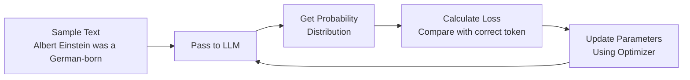

**Step-by-Step Process**:

1. **Sample partial text**: "Albert Einstein was a German-born"
2. **Pass to LLM**: Model outputs probability distribution over all tokens
3. **Know correct next token**: From training data, we know "physicist" is correct
4. **Create target vector**: One-hot vector with 1 at "physicist" ID, 0 elsewhere
5. **Calculate loss**: Measure difference between predicted probabilities and target
6. **Update parameters**: Use optimizer to adjust weights
7. **Repeat**: Continue with different text samples

#### Loss Function: Cross-Entropy

**Purpose**: Measure quality of predictions
* Compares predicted probability distribution with correct token
* **High loss**: Predictions far from correct answer
* **Low loss**: Predictions close to correct answer

**Mathematical Formula**:
* Cross-entropy has specific mathematical formulation
* Available on Wikipedia and ML textbooks
* Provides single number representing prediction quality

**Intuition**:
* If model assigns high probability to correct token: Low loss (good)
* If model assigns low probability to correct token: High loss (bad)
* Training goal: Minimize loss over all training examples

#### Optimization Algorithm

**Purpose**: Update model parameters to reduce loss

**Process**:
1. Take calculated loss value
2. Compute gradients (how to adjust each parameter)
3. Update all LLM parameters based on gradients
4. Goal: Next time same input is seen, predictions are more accurate

**Common Optimizers**:
* Adam
* SGD (Stochastic Gradient Descent)
* AdamW
* Others

**Key Point**: Optimization algorithms are well-established
* Same algorithms work across different models
* Core training code is straightforward
* Engineering complexity comes from scale, not algorithm

#### Training Outcome

**Result of Repeated Training**:
* Model learns statistical patterns in Internet data
* Weights adjusted to predict next token accurately
* Example: "Albert Einstein was a German-born" gets high probability for "physicist"

**Statistical Learning**:
* Model learns co-occurrence patterns
* Understands which words typically follow others
* Captures domain-specific terminology relationships

**Implicit Knowledge**:
* Model gains understanding of various domains
* Example: "I like machine learning because" triggers ML-related vocabulary
* Model has learned which terms are contextually relevant
* This is implicit world knowledge from Internet exposure

#### Engineering Challenges at Scale

**Why Training Large LLMs is Difficult**: Not algorithm complexity, but scale

**Memory Requirements** (example: Llama 3 405B parameters):

* **Model parameters**: 405B × 4 bytes (FP32) = 1.6 TB memory
* **Optimizer state**: Additional memory for gradients and momentum
* **Activations**: Intermediate values during forward/backward pass
* **Total estimate**: 2-5+ TB memory needed

**Hardware Constraints**:
* Best GPUs: ~80-100 GB memory
* Single GPU cannot fit large models
* **Minimum**: 16-20 GPUs just to load model
* **Realistic**: 2,000+ GPUs for efficient training

**Storage Requirements**:
* Must save model checkpoints during training
* Each checkpoint: 2-5 TB
* Multiple checkpoints for safety: 10-20+ TB total

**Llama 3 Training Setup** (from technical report):
* **16,000 H100 GPUs** used
* H100 = high-end GPU (most powerful available)
* Distributed across multiple data centers
* Complex infrastructure for networking and storage

**Engineering Solutions Required**:
* **Model parallelism**: Split model across GPUs
* **Data parallelism**: Process different batches on different GPUs
* **Pipeline parallelism**: Split computation stages
* **Memory optimization**: Gradient checkpointing, mixed precision
* **Network optimization**: Fast interconnects between GPUs

**Key Insight from Llama 3 Report**:
* Long section on infrastructure and scaling
* Many tricks and techniques needed
* Core algorithm is simple: Calculate loss, run optimizer
* Complexity is in making it work at scale

**In Practice**:
* Code for loss calculation: Simple (few lines)
* Code for optimization: Standard libraries
* Code for distributed training: Complex (thousands of lines)

### Text Generation

#### From Probabilities to Text

**LLM Output**: Probability distribution over vocabulary
* Example input: "Albert Einstein"
* LLM outputs: Vector of probabilities for next token
* Each value = probability of that token being next

**Challenge**: Need strategy to convert probabilities to actual token
* Cannot just use probabilities directly
* Need algorithm to select which token to generate

**Text Generation as Iterative Process**:

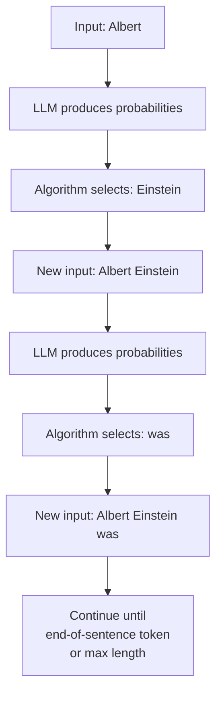

**Stopping Conditions**:
1. **End-of-sentence token**: Special token indicating completion
2. **Maximum length**: Pre-set limit on number of tokens

#### Decoding Algorithms: Two Categories

**Deterministic vs. Stochastic**:

* **Deterministic**: No randomness
  * Same input + same model = same output (always)
  * Repeatable generations
  * Examples: Greedy search, Beam search

* **Stochastic**: Includes randomness
  * Same input + same model = different outputs (each run)
  * Diverse generations
  * Examples: Multinomial sampling, Top-K, Top-P

#### Deterministic Algorithms

**1. Greedy Search**

**Algorithm**: Always pick highest probability token

**Example**:
* Input: "how"
* Probabilities: {are: 37%, is: 21%, do: 18%, ...}
* Greedy choice: "are" (highest at 37%)

**Visualization as Tree**:

```
Input: "how"
├─ are (56%) ✓ SELECTED
│  └─ you (91%) ✓
│     └─ doing (78%) ✓
├─ is (23%)
└─ do (21%)
```

* At each step, follow highest probability branch
* Final path: "how are you doing"

**Advantages**:
* Simple to implement
* Computationally efficient
* Fast generation

**Limitations**:
1. **No look-ahead**: Only considers current step probability
   * May miss better overall sequences in other branches
   * Locally optimal ≠ globally optimal

2. **Repetitive outputs**: Major problem in practice
   * Some token sequences have high probability
   * Greedy search keeps selecting same sequences
   * Results in text with repeated phrases

**Practical Demonstration** (GPT-2 model):

```python
from transformers import GPT2LMHeadModel, GPT2Tokenizer

model = GPT2LMHeadModel.from_pretrained("gpt2")
tokenizer = GPT2Tokenizer.from_pretrained("gpt2")

input_text = "I enjoy walking with my cute dog"
input_ids = tokenizer.encode(input_text, return_tensors="pt")

output = model.generate(input_ids, max_new_tokens=40)
# Result: "I enjoy walking with my cute dog, but I'm not sure
# if I'll ever be able to walk with my dog. I'm not sure
# if I'll ever be able to walk with my dog."
```

**Observation**: Clear repetition of "I'm not sure if I'll ever be able to walk with my dog"
* This sequence has high probability
* Greedy search deterministically selects it repeatedly
* **Not used in modern LLM production systems**

**2. Beam Search**

**Algorithm**: Keep track of top K paths (beams)

**How it Works** (K=3 example):

```
Step 1: Input "how"
├─ come (24%)  ✓ Keep
├─ are (31%)   ✓ Keep
└─ do (26%)    ✓ Keep
   └─ [discard all other options]

Step 2: Expand 3 paths
how come → animals (36%), ...
how are → you (91%), ...
how do → you (63%), ...

Calculate cumulative probabilities:
- how come animals: 24% × 36% = 8.64%
- how are you: 31% × 91% = 28.21% ✓
- how do you: 26% × 63% = 16.38% ✓

Keep top 3 cumulative probability paths
Continue until end...
```

**Advantages**:
* Explores multiple possibilities
* May find better overall sequences than greedy
* Sometimes outperforms greedy search

**Limitations**:
* Still suffers from repetition issues
* Fixed beam width may miss good alternatives
* More computation than greedy (K times more)
* **Not used in modern production LLMs**

**When to Use**:
* Historical interest mainly
* Some specialized applications
* Generally replaced by stochastic methods

#### Stochastic Algorithms

**1. Multinomial Sampling (Basic Randomness)**

**Algorithm**: Sample token according to probability distribution

**Example**:
* Probabilities: {are: 37%, is: 21%, do: 18%, hard: 5%, ...}
* Sample from distribution:
  * 37% chance of selecting "are"
  * 21% chance of selecting "is"
  * 5% chance of selecting "hard"

**Advantages**:
* Introduces diversity in generations
* Can discover different continuations
* Avoids deterministic repetition

**Critical Limitation**: **May sample very unlikely tokens**
* With enough runs, might select grammatically incorrect tokens
* Low-probability tokens can derail generation
* Example: "how hard" might be grammatically odd
* **Not used in production due to quality issues**

**2. Top-K Sampling (Improved Multinomial)**

**Algorithm**:
1. Keep only top K highest probability tokens
2. Discard all other tokens
3. Sample from remaining K tokens according to their probabilities

**Example** (K=3):
* Original: {are: 37%, is: 21%, do: 18%, hard: 5%, ...}
* After filtering: {are: 37%, is: 21%, do: 18%}
* Sample only from these 3 tokens

**Advantages**:
* Prevents sampling very unlikely tokens
* Maintains diversity among likely candidates
* Better quality than pure multinomial

**Limitation**: **Fixed K is not adaptive to probability distribution shape**

**Problem Illustration**:

Case 1: Model is confident
* Probabilities: {lot: 89%, much: 5%, high: 3%, ...}
* Model strongly prefers "lot"
* Top-K=3 still considers "much" and "high" (unnecessary)

Case 2: Model is uncertain
* Probabilities: {are: 31%, is: 29%, do: 22%, come: 11%, ...}
* Multiple good options
* Top-K=3 only considers 3, missing other reasonable choices

**Issue**: Fixed K doesn't adapt to model's confidence level

**3. Top-P (Nucleus) Sampling (Modern Standard)**

**Algorithm**:
1. Sort tokens by probability (highest to lowest)
2. Keep tokens until cumulative probability exceeds P
3. Discard remaining tokens
4. Sample from kept tokens

**Example** (P=0.88):

Case 1: Confident model
* Input: "Thanks a"
* Probabilities: {lot: 89%, much: 5%, high: 3%, ...}
* Cumulative: lot (89%) > 88% threshold
* **Keep only "lot"** (model is confident)

Case 2: Uncertain model
* Input: "how"
* Probabilities: {are: 31%, is: 29%, do: 22%, come: 11%, ...}
* Cumulative: are (31%) < 88%, are+is (60%) < 88%, are+is+do (82%) < 88%, are+is+do+come (93%) > 88%
* **Keep: are, is, do, come** (model uncertain, keep more options)

**Key Advantage**: **Adaptive K based on probability distribution**
* When model confident: Small K (few tokens)
* When model uncertain: Large K (many tokens)
* Adapts to each generation step

**Why Top-P is Production Standard**:
* Balances quality and diversity
* Adapts to model confidence
* Prevents both repetition and low-quality tokens
* **Used in all modern chatbot services**

**Practical Demonstration** (GPT-2 with Top-P):

```python
input_text = "I enjoy walking with my cute dog"
input_ids = tokenizer.encode(input_text, return_tensors="pt")

output = model.generate(
    input_ids,
    do_sample=True,      # Enable stochastic sampling
    top_p=0.92,          # Use Top-P with P=0.92
    max_new_tokens=40
)

# Run 1: "I enjoy walking with my cute dog, RM65 who is on a
# leash at home."

# Run 2 (same input): "I enjoy walking with my cute dog. I don't
# know what that is. I love walking with my baby dog and having
# an empty apartment without dogs and other convenience."
```

**Observations**:
* No repetition issues
* Different output each run (stochastic)
* Quality depends on base model (GPT-2 not strongest)
* With better models (GPT-3, GPT-4), much better continuations

#### Hyperparameters and Task-Specific Tuning

**Top-P Value (P)**:
* Controls diversity vs. quality trade-off
* **Low P (e.g., 0.1)**: Very conservative, high quality
* **High P (e.g., 0.95)**: More diverse, more creative

**Temperature**:
* Another hyperparameter that smooths probability distribution
* **Low temperature (0.1-0.5)**: Sharpens distribution, more deterministic
* **High temperature (1.5-2.0)**: Flattens distribution, more random

**Task-Specific Recommendations** (empirical guidelines):

| Task | Top-P | Temperature | Reasoning |
|------|-------|-------------|-----------|
| Code generation | 0.1 | Low | Need syntax correctness, not creativity |
| Factual QA | 0.3-0.5 | Low | Want accurate, reliable answers |
| General conversation | 0.9 | Medium | Balance quality and engagement |
| Creative writing | 0.95 | High | Want novelty and diverse ideas |

**Code Generation Example**:
* Want syntactically correct code
* Don't want creative/novel syntax
* Low P ensures only highly probable tokens
* Reduces risk of syntax errors

**Creative Writing Example**:
* Want interesting, varied language
* Okay with less common word choices
* High P allows more diverse vocabulary
* Increases novelty and creativity

**Important**: These are empirical guidelines, not strict rules
* Different models may have different optimal values
* Task specifics matter
* Experimentation recommended

## Post-Training Stage

### The Problem with Base Models

**Base Model Characteristics** (after pre-training only):
* Excellent at next token prediction
* Strong implicit knowledge of world
* Understands domain-specific terminology
* **But**: Only continues text, does not answer questions

**Practical Demonstration** (GPT-2 base model):

```python
input_text = "I enjoy walking with my cute dog"
# Output: "I enjoy walking with my cute dog, my wife, and my friend.
# They always have me covered with a blanket..."
# → Continuation, not useful for Q&A

input_text = "I like machine learning because"
# Output: "I like machine learning because it's easier to understand,
# and you can use it to predict what people are going to say..."
# → Uses ML terminology correctly, but just continues

input_text = "How is the weather"
# Output: "How is the weather? Weather is one of the most common
# problems for people who are tired and stressed."
# → Does NOT answer the question, just continues
```

**Observations**:
* Model has domain knowledge (uses ML terms correctly)
* Contextually relevant continuations
* But fundamentally wrong behavior for chatbot use case

**Larger Base Models Perform Better** (Llama 3.1 405B base):

```
Input: "I like machine learning because"
Output: "I like machine learning because it's a set of tools that
can be applied to a variety of problems. You can use machine learning
to predict the price of a house or the probability that someone will
click on an ad. You can also use it to identify faces..."
```

* Much more coherent and detailed
* Demonstrates deeper understanding
* Still just continuation, not question-answering

```
Input: "In quantum computing"
Output: "In quantum computing, we often want to construct a circuit
to perform a particular operation. One way to do this is to design
a circuit directly..."
```

* Sophisticated domain knowledge
* Proper terminology usage
* But still not answering questions

**Key Insight**: Base models have knowledge but wrong output format
* Need to adapt from "completion engine" to "question-answering system"
* This is the purpose of post-training

### Post-Training Overview

**Two Steps**:
1. **Supervised Fine-Tuning (SFT)**: Adapt format from completion to Q&A
2. **Reinforcement Learning (RL)**: Improve quality, safety, helpfulness

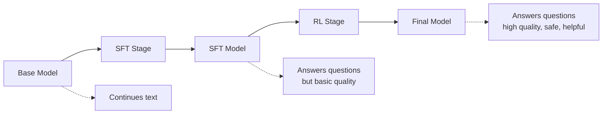

### Step 1: Supervised Fine-Tuning (SFT)

**Also Called**: Instruction fine-tuning

**Goal**: Teach model to follow instructions rather than just complete text

**Example Behavior Change**:

Before SFT (base model):
```
Input: "I want to learn ML. What should I do?"
Output: "Is it even easy? I'm not so confident..."
→ Continues with more questions
```

After SFT:
```
Input: "I want to learn ML. What should I do?"
Output: "Take Andrew Ng's course on Coursera."
→ Actually answers the question
```

#### SFT Data Preparation

**Data Format Requirements**: Prompt-response pairs

**Example Format**:
```
[PROMPT] Give three tips for staying healthy
[RESPONSE] 1. Exercise regularly for at least 30 minutes daily
2. Maintain a balanced diet rich in fruits and vegetables
3. Get 7-9 hours of quality sleep each night
```

**Special tokens** mark prompt and response sections

**Data Characteristics**:
* **Manually curated**: Requires human experts/annotators
* **High quality**: Carefully crafted responses
* **Size**: Tens of thousands to hundreds of thousands of examples
* **Much smaller than pre-training data** but higher quality

**Example Datasets**:

1. **Alpaca Dataset** (open source):
   * Format: Instruction + Output columns
   * Examples:
     * "Give three tips for staying healthy" → [three tips]
     * "How can we reduce air pollution?" → [detailed answer]
     * "Describe a time when you had to make a difficult decision" → [response]
   * Available on Hugging Face

2. **InstructGPT Dataset** (OpenAI, not open source):
   * Created by hiring expert annotators
   * ~14,500 prompt-response pairs
   * Used to train GPT-3.5 from GPT-3 base
   * Published in paper: "Training Language Models to Follow Instructions with Human Feedback" (March 2022)
   * Likely foundation for initial ChatGPT release

3. **Other Open Source Datasets**:
   * **Dolly** by Databricks
   * **FLAN** by Google
   * Many domain-specific instruction datasets on Hugging Face
   * Examples: Math-focused, code-focused, etc.

**Data Size Comparison**:
* Pre-training data: Trillions of tokens (entire Internet)
* SFT data: 10K-100K examples
* **Quality over quantity**: SFT data is curated, pre-training data is noisy

#### SFT Training Process

**Key Insight**: **Identical to pre-training algorithm**
* Same loss function (cross-entropy)
* Same optimization algorithms
* Same next-token prediction objective
* **Only difference**: Replace pre-training data with SFT data

**Training Process**:

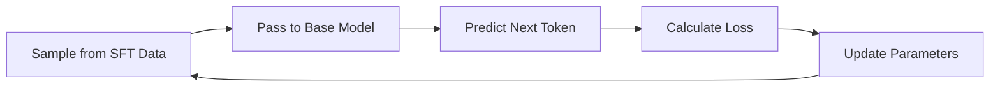

**Example**:
* Sample: "What is the capital of France? [RESPONSE] Paris is the capital..."
* Model learns to predict tokens in response section
* Over many examples, learns to answer rather than continue

**Training Details**:
* Start from base model parameters (not random initialization)
* Continue training on SFT data
* Run for enough iterations until model learns instruction-following
* Result: **SFT model** that answers questions

**Important**: No code changes needed from pre-training
* Same training script
* Just different data source
* Much faster than pre-training (days vs. months)

#### SFT Limitations

**Problem**: SFT model answers questions, but quality varies widely

**Example Comparison** (same question, different quality):

Response A:
```
"Take Andrew Ng's course on Coursera."
```
* Correct, contextually relevant
* But minimal, not very helpful

Response B:
```
"Start with a solid foundation in Python, linear algebra, probability,
and statistics. Then take a beginner-friendly ML course like Andrew Ng's
on Coursera. Practice by building small projects and exploring real datasets."
```
* Much more detailed
* More helpful and actionable
* Better overall response

**Both are valid SFT outputs**, but B is clearly superior

**Another Example**: "What are effective ways to reduce stress?"

Possible SFT outputs:
1. "Go skydiving for an adrenaline rush." (Not accurate)
2. "Exercise regularly and maintain a healthy diet." (Good, helpful)
3. "Shame on you, try meditation." (Rude, unsafe)
4. "Ignore your problems and hope they go away." (Not helpful)

**Issue**: SFT model can produce any of these
* All are grammatically correct
* All are contextually relevant (answer the question)
* But quality, safety, helpfulness vary greatly

**Solution**: Need reinforcement learning to prefer better responses

### Step 2: Reinforcement Learning (RL)

**Goal**: Generate responses that are:
* More correct and accurate
* More helpful and detailed
* More safe and polite
* Aligned with human preferences

**High-Level Approach**: **Practicing algorithm**

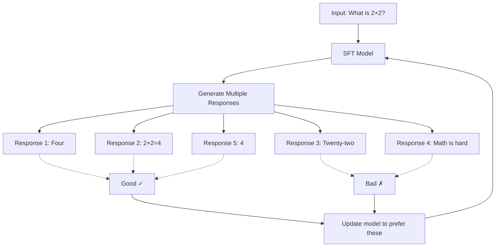

**Process**:
1. Give SFT model same prompt multiple times
2. Model generates various responses
3. Evaluate which responses are better
4. Update model parameters to prefer better responses
5. Repeat with many prompts

**Key Question**: How do we determine which responses are better?

**Answer depends on task type**: Verifiable vs. Unverifiable

#### Task Categorization: Verifiable vs. Unverifiable

**Verifiable Tasks**: Can automatically verify correctness

**Examples**:
* **Math problems**: "What is 2+2?" → Correct answer is "4"
  * Easy to check if response contains correct final answer
  * Incorrect if final answer is not "4"

* **Coding**: "Write a function to sort a list" → Can run and test code
  * Execute code
  * Check if output matches expected behavior
  * Verify no errors

**Characteristics**:
* Clear correct answer exists
* Can write automated checker
* No human judgment needed

**Unverifiable Tasks**: Cannot easily verify correctness automatically

**Examples**:
* **Creative writing**: "Help me choose a name for my startup"
  * Multiple valid answers
  * Subjective preferences
  * No single "correct" answer

* **Brainstorming**: "Suggest marketing strategies"
  * Many possible good responses
  * Difficult to rank objectively
  * Context-dependent quality

**Characteristics**:
* Subjective evaluation
* Multiple valid answers
* Requires human judgment

**Why This Matters**: Different approaches for RL training
* Verifiable: Can automate response scoring
* Unverifiable: Need human feedback

#### RL for Verifiable Tasks

**Approach**: Automatic verification + RL algorithm

**Process**:

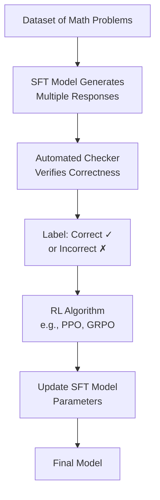

**Step 1: Generate and Label**
* Have dataset of problems with known answers
* SFT model generates multiple responses per problem
* **Automated checker** (Python code) verifies final answer
* Label each response: Correct or Incorrect

**Example**:
```
Problem: "What is 2+2?"
Response 1: "The answer is four." → Correct ✓
Response 2: "2+2 equals 4." → Correct ✓
Response 3: "It's 22." → Incorrect ✗
Response 4: "Math is hard." → Incorrect ✗
Response 5: "Four." → Correct ✓
```

**Step 2: Apply RL Algorithm**
* Use algorithm like **PPO** (Proximal Policy Optimization) or **GRPO**
* Algorithm takes:
  * Prompt
  * Multiple responses
  * Labels (correct/incorrect)
* Updates model parameters to:
  * **Increase probability** of generating correct responses
  * **Decrease probability** of generating incorrect responses

**Outcome**: Model reinforced to produce correct answers
* Given "What is 2+2?", more likely to generate "4"
* Learns patterns that lead to correct answers

**Advantages**:
* Fully automated (no human annotation needed)
* Scalable to large datasets
* Clear objective (correctness)

#### RL for Unverifiable Tasks: RLHF

**RLHF**: Reinforcement Learning from Human Feedback

**Challenge**: Cannot automatically determine which responses are better

**Solution**: Train a separate model to score responses

**Two Stages**:
1. **Train Reward Model**: Learn to score responses like humans would
2. **Optimize with RL**: Use reward model scores to improve SFT model

##### Stage 1: Training Reward Model

**Step 1: Collect Prompts**
* Gather diverse prompts: "What is the capital of France?", "Name a famous physicist", etc.

**Step 2: Generate Multiple Responses**
* Use SFT model to create multiple responses per prompt

**Example**:
```
Prompt: "What is the capital of France?"
Response 1: "Paris"
Response 2: "It's in Europe"
Response 3: "It's Eiffel Tower"
```

**Step 3: Human Ranking**
* Hire annotators (actual humans)
* Annotators rank responses by quality
* Example ranking: Paris > It's in Europe > It's Eiffel Tower

**Step 4: Create Training Data**
* Convert rankings to pairwise comparisons
* Format: Prompt + Winning Response + Losing Response

**Training Examples**:
```
Prompt: "What is the capital of France?"
Winning: "Paris"
Losing: "It's in Europe"

Prompt: "What is the capital of France?"
Winning: "It's in Europe"
Losing: "It's Eiffel Tower"

Prompt: "What is 2+2?"
Winning: "Four"
Losing: "Math is hard"
```

**Step 5: Train Reward Model**

**Reward Model**:
* Input: Prompt + Response
* Output: Score (single number)

**Training Process**:

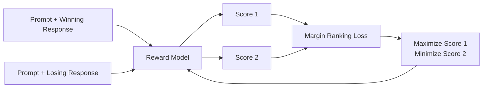

* Pass winning response: Get score S1
* Pass losing response: Get score S2
* **Loss function** (Margin Ranking Loss): Tries to maximize (S1 - S2)
* Goal: Winning responses get higher scores than losing responses

**Outcome**: Reward model that scores responses aligned with human preferences

**Reward Model as Proxy**: Replaces human annotators
* Instead of humans ranking each response
* Reward model automatically scores responses
* Should align with human judgments (learned from training data)

##### Stage 2: Optimize SFT Model with RL

**Process**: Very similar to verifiable tasks, but uses reward model

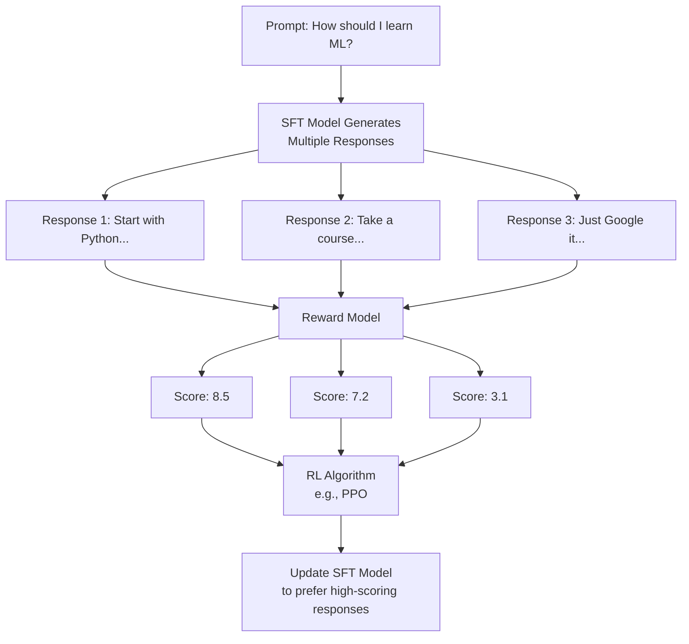

**Steps**:
1. Give prompt to SFT model
2. Generate multiple responses
3. **Reward model scores each response**
4. RL algorithm (PPO) updates SFT model parameters
5. Goal: Generate responses with higher reward scores

**Key Difference from Verifiable**:
* Verifiable: Automated checker determines correctness
* Unverifiable: Reward model determines quality

**Outcome**: **Final model** that produces responses aligned with human preferences
* More detailed and helpful
* More accurate and correct
* Safer and more polite

#### Complete Post-Training Summary

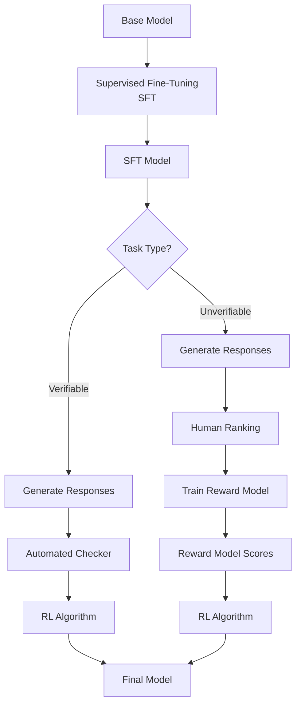

**Stage Summary**:

1. **SFT**: Base model → SFT model
   * Learns to answer questions (format adaptation)
   * Uses demonstration data (prompt-response pairs)
   * Identical algorithm to pre-training (just different data)

2. **RL** (if verifiable tasks):
   * SFT model → Final model
   * Uses automated verification
   * Reinforces correct responses

3. **RLHF** (if unverifiable tasks):
   * Train reward model from human feedback
   * Use reward model to score responses
   * Reinforce high-scoring responses

**Final Result**: Model suitable for production chatbot deployment

### Practical Demonstration: Base vs. Post-Trained

**Base Model** (Llama 3.1 405B base):
```
Input: "I want to learn ML. What should I do?"
Output: "What are the resources I should follow? How long will it take?..."
→ Continues with more questions (completion behavior)
```

**Post-Trained Model** (Llama 3.1 405B post-trained):
```
Input: "I want to learn ML. What should I do?"
Output: "Learning machine learning is an exciting journey. Here is a
step-by-step guide to help you get started:

Step 1: Build foundational knowledge
- Mathematics: Linear algebra, calculus, probability, statistics
- Programming: Python (essential for ML)

Step 2: Take structured courses
- Andrew Ng's Machine Learning course on Coursera
- Fast.ai's Practical Deep Learning for Coders
...

[Formatted with bold text, bullet points, clear structure]"
```

**Differences**:
* **Format**: Post-trained provides structured, formatted answer
* **Helpfulness**: Detailed, actionable steps vs. more questions
* **Quality**: Professional, complete response vs. incomplete continuation
* **This is the impact of post-training**

## Model Evaluation

### Training Stage Summary

**Overview of Four Stages**:

| Stage | Data | Size | Quality | Compute | Training Time | ML Objective | Output |
|-------|------|------|---------|---------|---------------|--------------|--------|
| **Pre-Training** | Internet data | Trillions of tokens | Low quality, high quantity | Thousands of GPUs | Months | Next token prediction | Base model |
| **SFT** | Prompt-response pairs | 10K-100K examples | High quality, low quantity | Hundreds of GPUs | Days | Next token prediction | SFT model |
| **Reward Modeling** | Comparison data (ranked responses) | 10K-100K comparisons | High quality | Hundreds of GPUs | Days | Predict scores | Reward model |
| **Reinforcement Learning** | Prompts only | 10K-100K prompts | N/A | Hundreds of GPUs | Days | Maximize reward score | Final model |

**Key Points**:
* Pre-training is by far most expensive (cost, time, compute)
* Post-training stages relatively cheap in comparison
* Same next-token prediction objective for pre-training and SFT
* RL uses different objective (maximize reward)

### Why Evaluation Matters

**Reality**: Many LLMs exist from different companies
* DeepSeek, Qwen, Llama, GPT, Claude, Gemini, Grok, and many more
* Models of different sizes: Small, medium, large
* Continuously updated with new versions

**Questions**:
* Which model is better?
* How to compare models objectively?
* How to track improvement over time?

**Solution**: Systematic evaluation methods

### Evaluation Categories

**Two Main Approaches**:

1. **Offline Evaluation**: Test models in controlled environment
   * Use evaluation datasets
   * Measure performance metrics
   * Compare before deployment

2. **Online Evaluation**: Test models in production
   * Real user interactions
   * Monitor live performance
   * Collect feedback from actual usage

### Offline Evaluation Methods

#### 1. Traditional Metrics: Perplexity

**Definition**: Measures how accurately model predicts exact token sequences

**How it Works**:
* Take evaluation data: "how are you doing"
* Calculate probability of model generating this exact sequence
* Pass "how" → get P(are | how)
* Pass "how are" → get P(you | how are)
* Pass "how are you" → get P(doing | how are you)
* Combine probabilities (multiply or sum of logs)

**Formula**: Mathematical formula available on Wikipedia

**Interpretation**:
* **Low perplexity**: Model can reproduce evaluation data well
* **High perplexity**: Model struggles to reproduce evaluation data

**Limitations**: **No longer meaningful for modern LLMs**
* Reproducing text ≠ useful for humans
* Doesn't measure helpfulness, correctness, or safety
* Just measures memorization/statistical fit
* **Not used as primary evaluation metric today**

#### 2. Task-Specific Benchmarks (Modern Standard)

**Purpose**: Assess performance on diverse real-world tasks

**Major Domains**:
* Mathematics
* Code generation
* Common sense reasoning
* World knowledge
* Language understanding
* Problem solving

**How it Works**:
* Each domain has benchmark datasets
* Datasets contain problems with known correct answers
* Pass problems to LLM
* Compare LLM output with correct answer
* Calculate accuracy/score

**Example Benchmarks**:

**Common Sense Reasoning**:
```
Prompt: "The trophy doesn't fit in the brown suitcase because
it's too large. What is too large?
(A) The trophy
(B) The suitcase"

Correct Answer: (A) The trophy
```

* Pass to LLM, see if it selects (A)
* Repeat across many examples
* Calculate percentage correct

**Benchmark examples**: HellaSwag, PIQA, ARC

**World Knowledge**:
```
Prompt: "Who wrote Romeo and Juliet?"
Correct Answer: "William Shakespeare"
```

* Test factual knowledge
* Measure accuracy on fact-based questions

**Benchmark examples**: TriviaQA, NaturalQuestions

**Mathematical Reasoning**:
```
Prompt: "If a train travels 60 miles per hour for 3 hours,
how far does it travel?"
Correct Answer: "180 miles"
```

* Test math capabilities
* Can check numerical answer

**Benchmark examples**: GSM8K, MATH

**Code Generation**:
```
Prompt: "Write a Python function to check if a number is prime."
Correct Answer: [valid Python function]
```

* Can execute code
* Test if output is correct
* Check for errors

**Benchmark examples**: HumanEval, MBPP

**Why This Matters**:
* These benchmarks test capabilities humans care about
* Provide quantitative comparison between models
* Track progress over time
* Industry standard for model evaluation

**Common Practice**: Model papers report scores on multiple benchmarks
* Allows direct comparison with other models
* Shows strengths and weaknesses across domains

#### 3. Human Evaluation

**Approach**: Expert humans assess model outputs

**Process**:
* Hire domain experts
* Give them challenging questions
* Ask models to answer
* Experts evaluate:
  * Correctness
  * Helpfulness
  * Clarity
  * Safety

**Advantages**:
* Can assess nuanced quality
* Captures human preferences directly
* Evaluates aspects hard to automate

**Limitations**:
* **Subjective**: Different evaluators may disagree
* **Biased**: Personal preferences influence judgments
* **Expensive**: Requires paid expert time
* **Slow**: Cannot scale to large test sets
* **Domain-dependent**: Quality depends on evaluator expertise

**When Used**:
* Assessing creativity, style, tone
* Evaluating complex reasoning
* Safety and ethical considerations
* Complementing automated benchmarks

### Online Evaluation Methods

#### 1. Human Feedback in Production

**Implementation**: Built into user interface

**Example (ChatGPT)**:
* User asks question
* Model generates response
* UI shows thumbs up / thumbs down buttons
* User rates response

**Data Collected**:
* User satisfaction signals
* Which responses are helpful
* Which responses are problematic

**Uses**:
1. **Evaluation**: Track model performance over time
   * Compare thumbs up/down ratios between model versions
   * Identify problems or regressions

2. **Training Data**: Use for further improvement
   * Negative feedback highlights areas to improve
   * Positive feedback shows successful patterns
   * Can feed into future RLHF training

**Advantages**:
* Real user feedback
* Large scale data collection
* Continuous monitoring

**Limitations**:
* Users may not always rate accurately
* Selection bias (who chooses to rate)
* May not represent all use cases

#### 2. Crowdsourcing Platforms

**Most Notable: LMSYS Chatbot Arena**

**What it is**:
* Public web-based platform
* Developed by Berkeley students/researchers
* Ranks LLMs through crowdsourced comparisons

**How it Works**:

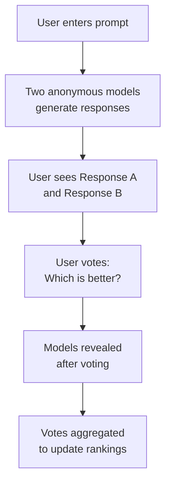

**Key Features**:
* **Anonymous comparison**: User doesn't know which model is which
* **Prevents bias**: Can't favor based on model name/company
* **Pairwise voting**: Choose between two responses
* **Large scale**: Thousands of user votes
* **Public leaderboard**: Rankings visible to everyone

**LMSYS Leaderboard** (example snapshot):

| Rank | Model | Developer | Score | License | Notes |
|------|-------|-----------|-------|---------|-------|
| 1 | Gemini 2.5 Pro | Google | 1343 | Proprietary | Closed |
| 2 | o3 | OpenAI | 1337 | Proprietary | Closed |
| 3 | GPT-4.5 | OpenAI | 1328 | Proprietary | Closed |
| 4 | Claude Opus 4 | Anthropic | 1315 | Proprietary | Closed |
| ... | ... | ... | ... | ... | ... |
| 30 | DeepSeek | DeepSeek | 1245 | MIT | Open source, open weights |
| ... | ... | ... | ... | ... | ... |
| 209 | Llama 13B | Meta | 892 | Open | Older model |

**Observations**:
* **211 models** currently ranked
* Rankings continuously updated
* Newer models typically rank higher
* Mix of closed and open source models
* Clear metric for comparing models

**Advantages**:
* Large-scale real user preferences
* Unbiased (anonymous voting)
* Covers diverse use cases
* Public and transparent

**Limitations**:
* May not represent enterprise use cases
* Users have varying expertise levels
* Some tasks better suited for voting than others

**Industry Impact**:
* Companies track their ranking
* Influences model development priorities
* Used in marketing and product positioning
* Community reference point

### Evaluation Summary

**Multi-Faceted Approach**: No single perfect evaluation method

**Best Practice**: Combine multiple evaluation types
* **Automated benchmarks**: Quantitative, scalable, consistent
* **Human evaluation**: Qualitative, nuanced, contextual
* **Production feedback**: Real-world usage, actual user needs
* **Crowdsourcing**: Large-scale preferences, unbiased comparison

**Evolution of Models**: Rankings change frequently
* Companies release new versions regularly
* Competition drives rapid improvement
* Today's leader may not be tomorrow's

## System Design and Architecture

### Chatbot System Components

**Reality**: Trained LLM is small part of complete chatbot service

**Full System Architecture**:

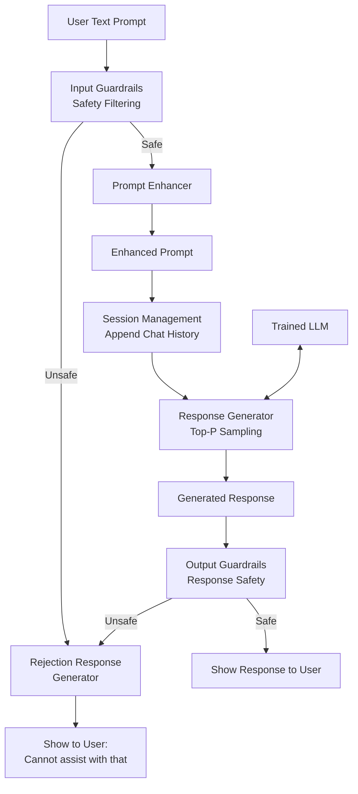

**Important**: This is simplified - production systems may have more components

### Component Details

#### 1. Input Guardrails (Safety Filtering)

**Purpose**: Ensure user prompt is safe to process

**What it Checks**:
* Violence or harmful content
* Illegal requests
* Inappropriate content
* Attempts to jailbreak or misuse model

**How it Works**:
* Usually machine learning classifier
* Trained to detect unsafe prompts
* Fast screening before expensive LLM processing

**Decision**:
* **If unsafe**: Route to rejection response
  * Example: "I cannot assist with that request"
  * No LLM processing (saves compute)

* **If safe**: Continue to next stage

**Why Important**:
* Prevents misuse
* Protects brand reputation
* Ensures compliance with policies
* Saves compute on problematic requests

#### 2. Prompt Enhancer

**Purpose**: Improve input quality before LLM processing

**What it Fixes**:
* **Typos and misspellings**: "machien lerning" → "machine learning"
* **Grammar errors**: Corrects grammatical mistakes
* **Punctuation**: Adds missing punctuation
* **Ambiguity**: Clarifies vague prompts
* **Formatting**: Standardizes input format

**Implementation**:
* Combination of heuristics (rule-based)
* Machine learning models (trained for text correction)
* May use smaller specialized models (faster than main LLM)

**Why Important**:
* LLM performs better with clean input
* Reduces ambiguity in responses
* Improves overall response quality
* Helps model understand user intent

**Example**:
```
Original: "hw do i lern python its very hard"
Enhanced: "How do I learn Python? It's very hard."
→ Clear, well-formed question for LLM
```

#### 3. Session Management (Chat History)

**Purpose**: Enable multi-turn conversations with context

**Challenge**: LLM only sees current input
* Without memory, cannot handle follow-ups
* Example: "Make it shorter" - what is "it"?

**Solution**: Append entire conversation history to each new prompt

**How it Works**:

```
Turn 1:
User: "Help me choose a startup name"
Assistant: "Here are some suggestions: TechFlow, InnovateLab, ..."

Turn 2:
Input to LLM:
"[Previous conversation]
User: Help me choose a startup name
Assistant: Here are some suggestions: TechFlow, InnovateLab, ...

[New message]
User: Make them more formal"
```

**Key Points**:
* Full history sent with each new message
* LLM sees complete context
* Enables natural follow-up questions
* History scoped to session/conversation

**Implementation Details**:
* Store chat history in session state
* Prepend history to new prompts
* May truncate very long histories (token limits)
* Clear when user starts new conversation

**Example Use Case**:
```
User: "Explain quantum computing"
Assistant: [Detailed explanation]
User: "Give me an example"
→ Model understands "example" refers to quantum computing
User: "What are practical applications?"
→ Model maintains quantum computing context
```

#### 4. Response Generator

**Purpose**: Generate tokens iteratively using trained LLM

**Process**:
* Takes enhanced prompt + chat history
* Calls trained LLM repeatedly
* Uses text generation algorithm (Top-P sampling)
* Continues until completion

**Implementation Details**:
* Top-P sampling (discussed earlier)
* Hyperparameters: P value, temperature, max length
* Iterative token-by-token generation
* Stops at end-of-sentence token or max length

**Optimization Considerations**:
* Inference speed critical for user experience
* May use model quantization (reduce precision)
* Batching multiple requests
* GPU/specialized hardware acceleration

#### 5. Output Guardrails (Response Safety)

**Purpose**: Ensure generated response is safe to show user

**What it Checks**:
* Harmful or dangerous content
* Biased or discriminatory language
* Leaked sensitive information
* Incorrect safety-critical information
* Content violating policies

**How it Works**:
* Machine learning classifier
* Analyzes generated response
* Trained on examples of unsafe outputs

**Decision**:
* **If safe**: Show response to user
* **If unsafe**: Route to rejection response
  * Example: "I apologize, I cannot provide that information"
  * May appear to user as if model cannot answer

**Why Needed**:
* LLM may occasionally generate unsafe content
* Even with post-training, edge cases exist
* Extra safety layer for production systems
* Protects users and company

**Trade-off**: May occasionally block legitimate responses (false positives)

### System Design Summary

**Key Insights**:
1. **LLM is not standalone**: Requires extensive supporting infrastructure
2. **Safety is multi-layered**: Input and output guardrails
3. **Quality enhancement**: Pre and post-processing improve results
4. **Context management**: Session handling enables conversations
5. **Real systems more complex**: Production systems have additional components for:
   * Logging and monitoring
   * Rate limiting
   * User authentication
   * Load balancing
   * Caching
   * A/B testing
   * Error handling

**Engineering Reality**:
* Trained LLM = core capability
* Complete chatbot = LLM + extensive supporting systems
* Quality and safety require multiple layers
* User experience depends on entire stack

## Key Insights

### Fundamental Principles

* **LLMs are next-token predictors**: At their core, LLMs predict the next token in a sequence based on statistical patterns learned from training data. This simple objective underlies all their capabilities.

* **Two-stage training is essential**: Pre-training provides world knowledge through exposure to Internet data, while post-training adapts the model for practical use by teaching instruction-following and improving quality/safety.

* **Scale matters but is expensive**: Larger models with more parameters generally perform better, but training them requires massive computational resources (thousands of GPUs, millions of dollars) accessible only to well-funded organizations.

* **Base models vs. fine-tuned models serve different purposes**: Base models excel at text completion and have implicit world knowledge, but only post-trained models can serve as useful chatbots that answer questions helpfully and safely.

### Important Distinctions and Comparisons

* **Verifiable vs. unverifiable tasks** (Critical Distinction):
  * **Verifiable tasks** (math, coding): Can automatically check correctness, enabling automated RL training without human annotation
  * **Unverifiable tasks** (creative writing, brainstorming): Require human feedback and reward models (RLHF) to assess quality
  * This distinction fundamentally changes the training approach and data requirements

* **Word-level vs. character-level vs. subword-level tokenization**:
  * **Word-level**: Huge vocabulary (270K+ tokens), expensive to train - not used in modern LLMs
  * **Character-level**: Small vocabulary but very long sequences, computationally expensive - not used in modern LLMs
  * **Subword-level** (BPE): Optimal balance of vocabulary size and sequence length - industry standard for all modern LLMs

* **Greedy vs. beam search vs. Top-P sampling**:
  * **Greedy search**: Deterministic, always picks highest probability, suffers from repetition - not used in production
  * **Beam search**: Keeps top K paths, explores more options than greedy but still deterministic - not used in production
  * **Top-P (Nucleus) sampling**: Adaptive stochastic sampling that adjusts to model confidence - production standard for all modern LLMs

* **Pre-training data vs. post-training data quality and quantity**:
  * **Pre-training**: Trillions of tokens, low quality (noisy Internet data), high quantity
  * **SFT data**: 10K-100K examples, high quality (expert curated), low quantity
  * Trade-off: Pre-training needs scale, post-training needs quality

* **Deterministic vs. stochastic text generation**:
  * **Deterministic**: Same input always produces same output, no randomness, prone to repetition
  * **Stochastic**: Same input can produce different outputs, introduces diversity, prevents repetition
  * Modern systems use stochastic methods exclusively

### Practical Considerations

* **Tokenization efficiency varies by language**: Non-English languages often require 2-3x more tokens than English for the same text, affecting cost and performance.

* **Context matters in generation**: Session management (appending chat history) enables follow-up questions and maintains conversational context, critical for chatbot usability.

* **Multiple evaluation methods necessary**: No single metric captures all aspects of model quality. Combine automated benchmarks, human evaluation, and production feedback for comprehensive assessment.

* **Data cleaning is crucial but complex**: Raw HTML contains irrelevant tags, duplicated content, and unsafe material. Multi-stage cleaning pipelines (URL filtering, deduplication, PII removal) are essential for quality training data.

* **Safety requires multiple layers**: Both input guardrails (checking user prompts) and output guardrails (checking model responses) are necessary because unsafe content can enter from either direction.

* **Hyperparameter tuning is task-specific**:
  * Code generation needs low Top-P (0.1) for correctness
  * Creative writing needs high Top-P (0.95) for novelty
  * No universal optimal values - experimentation required

* **Production systems are much more complex than trained models**: Complete chatbot requires prompt enhancement, safety filtering, session management, response post-processing, and extensive infrastructure - trained LLM is just one component.

### Common Pitfalls and Misconceptions

* **Base models cannot be directly deployed**: Despite having impressive knowledge, base models only continue text rather than answer questions, making them useless for chatbot applications without post-training.

* **More parameters generally better but not always necessary**: A well-trained smaller model can outperform a poorly-trained larger model. Context and training quality matter significantly.

* **Perplexity is not a useful evaluation metric for modern LLMs**: It measures statistical fit to data, not helpfulness, correctness, or safety - task-specific benchmarks are far more meaningful.

* **RLHF requires human feedback only for reward model training**: Once reward model is trained, the actual RL phase is automated - common misconception that humans rate every response during RL.

* **Character-level tokenization seems simple but is impractical**: Very long sequences make training computationally prohibitive despite small vocabulary.

* **Greedy search is not optimal despite picking highest probability**: Local optimization at each step doesn't guarantee globally optimal sequence, and repetition is a severe problem.

## Quick Recall / Implementation Checklist

* [ ] **Data Preparation**: Understand the three-stage pipeline (crawling, cleaning, tokenization) and that clean datasets like FineWeb can provide good starting points
* [ ] **Tokenization strategy**: Use subword-level tokenizers (BPE) for modern LLMs - word-level and character-level are obsolete
* [ ] **Vocabulary size matters**: Larger vocabularies (100K-200K tokens) are more efficient for newer models than older 50K vocabularies
* [ ] **Distinguish verifiable vs. unverifiable tasks**: This determines whether you need automated verification or RLHF approach for reinforcement learning
* [ ] **Base models require post-training**: Never deploy base models directly - they complete text but don't answer questions
* [ ] **SFT uses same algorithm as pre-training**: Only the data changes (prompt-response pairs vs. raw Internet text) - no code changes needed
* [ ] **Reward models are proxies for human judgment**: Train once with human feedback, then use for automated scoring during RL
* [ ] **Top-P sampling is production standard**: Use Top-P (nucleus sampling) for all text generation - greedy and beam search cause repetition
* [ ] **Hyperparameters are task-specific**: Low Top-P (0.1-0.3) for factual/code tasks, high Top-P (0.9-0.95) for creative tasks
* [ ] **Temperature controls randomness**: Low temperature (0.1-0.5) for deterministic outputs, high temperature (1.5-2.0) for creative diversity
* [ ] **Session management enables conversations**: Append full chat history to each new prompt so LLM maintains context for follow-ups
* [ ] **Multi-layered safety is essential**: Implement both input guardrails (filter unsafe prompts) and output guardrails (verify response safety)
* [ ] **Prompt enhancement improves quality**: Fix typos, grammar, and ambiguity before LLM processing for better responses
* [ ] **Use task-specific benchmarks for evaluation**: Perplexity is obsolete - use domain benchmarks (math, coding, reasoning, knowledge) that matter for your use case
* [ ] **Monitor production with human feedback**: Implement thumbs up/down ratings to track model performance and collect training data
* [ ] **Engineering complexity is in scale, not algorithms**: Training code is straightforward (loss calculation + optimizer), but distributed training across thousands of GPUs requires extensive engineering
* [ ] **Common Crawl provides free web data**: No need to crawl yourself for research/startup use cases - use publicly available cleaned datasets
* [ ] **Model size vs. capability trade-off**: More parameters = more capability but also more cost (training, inference, memory) - choose appropriate size for use case
* [ ] **Pre-training is prohibitively expensive for most**: Hundreds of millions of dollars and months of training - only large companies can afford; most applications should use existing base models
* [ ] **Evaluation should be multi-faceted**: Combine automated benchmarks, human evaluation, and crowdsourcing platforms for comprehensive assessment
* [ ] **TikToken library for practical tokenization**: Use OpenAI's TikToken for fast BPE tokenization with pre-trained vocabularies
* [ ] **SFT data quality over quantity**: 10K-100K high-quality curated examples better than millions of noisy examples
* [ ] **Llama models offer open alternatives**: Open source models like Llama 3 (405B parameters) compete with proprietary models for many use cases
* [ ] **Inference optimization critical for production**: Model quantization, batching, and specialized hardware necessary for acceptable response times
* [ ] **Rankings change frequently**: Companies continuously release improved models - LMSYS leaderboard tracks current state of the art
