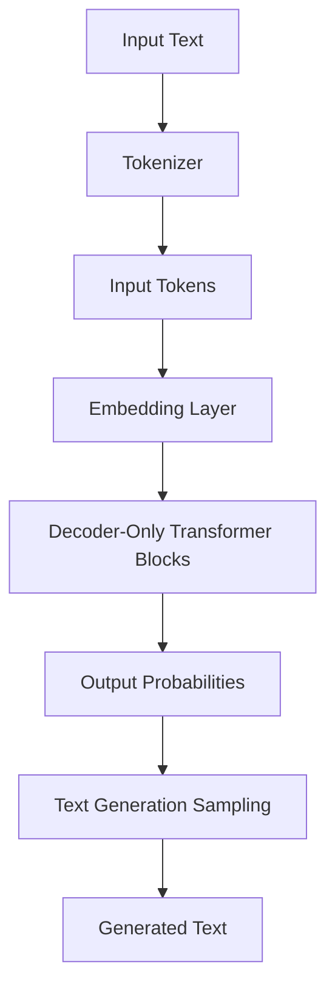

# LLM Foundations

## Overview

This lecture introduces the foundations of Large Language Models (LLMs), emphasizing their critical role in advanced AI applications such as agents, reasoning models, coding platforms, and productivity tools. The focus is on understanding how LLMs are built, trained, and operate in practice. The training process is divided into two main stages: **pre-training** and **post-training**. A hands-on project to build an LLM playground in Python is included. 

## Core Concepts

### Large Language Models (LLMs)

* **Definition:** AI models that understand and generate text, capable of engaging in conversational interactions.
* **Functionality:** Can answer questions and respond to follow-up queries when trained correctly.
* **Popular Examples:** ChatGPT (OpenAI), Claude (Anthropic), Gemini (Google), Grok (XAI), Meta AI (Meta). 

### Training Stages

* **Pre-training:** The model learns from vast internet data to predict the next token. This stage is expensive and forms the foundation of the model's implicit knowledge.

* **Post-training:** Adapts the base model to answer questions, be helpful, and safe. Includes two steps:

  * **Supervised Fine-Tuning (SFT)**
  * **Reinforcement Learning (RL)** 

### Model Responses

* Different LLMs respond to the same prompt with varying detail, structure, and tone.
* More complex questions reveal differences in model capabilities.
* LLM quality evolves as companies train newer, more powerful models. 

## Tokenization

### Purpose

Converts text into numerical tokens for model processing. 

### Types of Tokenizers

#### Word-Level Tokenizers

* **Splitting Logic:** Splits text by whitespace to extract individual words.
* **Vocabulary Size:** Very large (hundreds of thousands of unique words).
* **Limitation:** Expensive to train due to huge vocabulary. **Not used in advanced LLMs.** 

#### Character-Level Tokenizers

* **Splitting Logic:** Splits text into individual characters.
* **Vocabulary Size:** Small (~105 tokens for English, including lowercase, uppercase, punctuation).
* **Limitation:** Creates very long sequences, making it costly for the model to learn dependencies. **Not used in advanced LLMs.** 

#### Subword-Level Tokenizers

* **Splitting Logic:** Splits text into units larger than characters but smaller than words.
* **Vocabulary Size:** Balanced (e.g., 50,000-200,000 tokens).
* **Advantage:** Sits between word-level and character-level, balancing vocabulary size and sequence length.
* **Industry Standard:** **Preferred for advanced LLMs.** 

### Byte Pair Encoding (BPE)

* **Algorithm:** A popular subword tokenization method.
* **Process:** Starts with characters and iteratively merges frequent token pairs to create new tokens.
* **Control:** Allows full control over vocabulary size (e.g., stopping at 50,000 tokens).
* **Usage:** **Used in GPT-2 and Llama 3.** 

### Vocabulary Size Comparison

* **Character-level:** ~105 tokens
* **Word-level:** ~270,000+ tokens
* **Subword-level:** ~50,000-200,000 tokens 

## Model Architecture

### Decoder-Only Transformer

* **Foundation:** Modern LLMs are based on the **decoder-only Transformer** architecture.

* **Differences:** LLMs differ primarily in hyperparameters such as:

  * **Number of layers (transformer blocks):** More layers = more parameters.
  * **Vector dimensions:** Size of the vectors the transformer processes. 

### Scaling and Parameters

* **Increasing Parameters:** Generally leads to more powerful models with greater capacity to learn complex mappings.

* **Trade-off:** More parameters require longer training times and significantly higher computational costs.

* **Examples:**

  * **GPT-2:** Largest model has ~1.5 billion parameters.
  * **GPT-3:** Largest model has 175 billion parameters.
  * **Llama 3:** Largest model has 405 billion parameters. 

______

## Real-World Practice: Training Challenges

### Resource Requirements for Large Models

Training a 405 billion parameter model (e.g., Llama 3) presents significant engineering challenges:

* **Memory:** Requires approximately **1.6 TB of memory** (using FP32, 4 bytes per weight).
* **GPUs:** Not practical on a single GPU. Realistically requires **2,000+ GPUs** (e.g., H100 GPUs).
* **Storage:** Each checkpoint can exceed **2-5 TB**.
* **Distributed Training:** Necessitates complex distributed training and parallelism techniques (e.g., model scaling, pipeline parallelism). 

### Engineering Complexity

* The Llama 3 technical report details extensive infrastructure, scaling, and efficiency optimizations.
* Training on **16,000 H100 GPUs** with significant network and storage challenges.
* Numerous tricks and engineering efforts are required to make training feasible. 

## Text Generation Algorithms

### Greedy Search

* **Process:** Deterministically picks the token with the **highest probability** at each step.

* **Advantages:** Simple and efficient.

* **Limitations:**

  * **No lookahead:** Does not consider future steps, leading to suboptimal sequences.
  * **Repetitive outputs:** Can repeatedly select the same sequence of tokens (e.g., GPT-2 example: "I'm not sure if I'll ever be able to walk with my dog" repeated multiple times).

* **Practical Use:** **Not used in practice for text generation in LLMs.** 

### Stochastic Algorithms

Introduce randomness to explore diverse continuations.

#### Multinomial Sampling

* **Process:** Samples tokens randomly according to their probabilities.
* **Limitation:** Can pick very unlikely or grammatically incorrect tokens.
* **Practical Use:** **Not used in practice for LLMs; improvements like Top-k and Top-p are preferred.** 

#### Top-k Sampling

* **Process:** Selects the top _k_ most probable tokens, then samples from this reduced set based on their probabilities.

* **Improvement:** Discards very unlikely tokens.

* **Limitation:** _k_ is fixed, which can be suboptimal:

  * Too many candidates when the model is confident.
  * Too few when the model is less confident. 

#### Top-p Sampling (Nucleus Sampling)

* **Process:** Dynamically selects the smallest set of tokens whose cumulative probability exceeds a threshold _p_, then samples from this set.

* **Improvement:** Addresses Top-k's limitation by adapting _k_ based on the probability distribution shape.

* **Hyperparameters:**

  * **p:** Cumulative probability threshold (e.g., 0.88, 0.92).
  * **Temperature:** Controls randomness (not detailed in this lecture).

* **Practical Use:** **Top-p is commonly used in practice in LLMs for text generation.** 

## Post-Training: Supervised Fine-Tuning (SFT)

### Purpose

Adapts a pre-trained **base model** (good at text continuation) to follow instructions and answer questions. 

### Base Model Capabilities

* **Implicit Knowledge:** Possesses knowledge from pre-training on internet data.
* **Limitation:** Does not directly answer questions; only continues text.
* **Example:** Asking "How is the weather?" results in a continuation like "Weather is one of the most common problems for people who are tired and stressed," rather than a direct answer. 

### Data Requirements (Demonstration Data)

* **Format:** Curated prompt-response pairs (e.g., "Give three tips for staying healthy" → "\[tips]").
* **Creation:** Manually created by experts or annotators.
* **Quality vs. Quantity:** High quality but significantly smaller in quantity than pre-training data (tens to hundreds of thousands of examples).
* **Examples:** Alpaca dataset, InstructGPT dataset (~14,500 examples, not open-source). 

### Training Process

* **Identical to Pre-training:** Uses the same algorithm, loss function, and optimization.
* **Data Replacement:** Replaces pre-training data with SFT demonstration data.
* **Objective:** Next token prediction, teaching the model to answer questions in the specified format. 

### Outcome

An **SFT model** capable of answering questions. 

## Post-Training: Reinforcement Learning from Human Feedback (RLHF)

### Purpose

Further adapts the SFT model to generate responses that are **preferred by humans** (correct, accurate, safe, helpful, polite). 

### Problem with SFT Models

SFT models can answer questions but may produce responses that are:

* Incorrect or inaccurate.
* Unhelpful or unsafe.
* Not aligned with human preferences. 

### Two Main Steps

#### Step 1: Training a Reward Model

**Data Preparation (Comparison Data):**

1. Collect initial prompts (e.g., "What is the capital of France?").
2. Use the SFT model to generate multiple responses for each prompt.
3. Human annotators rank these responses based on preference.
4. Create training data with "winning" and "losing" response pairs for each prompt. 

**Reward Model Training:**

* A separate model takes a **prompt and a response**, outputting a **score**.
* Trained using a loss function (e.g., **margin ranking loss**) to maximize the score difference between winning and losing responses.
* The trained reward model acts as a **proxy for human preferences**. 

#### Step 2: Optimizing the SFT Model with Reinforcement Learning (PPO)

**Process:**

* A reinforcement learning algorithm (e.g., **Proximal Policy Optimization - PPO**) updates the SFT model's parameters.
* For a given prompt, the SFT model generates multiple responses.
* The reward model scores each response.
* The PPO algorithm uses these scores to update the SFT model, **reinforcing responses with higher scores**. 

### Outcome

A **final model** that produces answers more aligned with human preferences, making it suitable for deployment as a chatbot. 

### Verifiable vs. Unverifiable Tasks

* **Verifiable Tasks:** Tasks with easily verifiable correctness (e.g., math problems, coding). Can use an automatic component to score responses.
* **Unverifiable Tasks:** Tasks difficult to verify automatically (e.g., creative writing, subjective questions). Requires a reward model trained on human feedback. 

## Challenges and Pitfalls

### Tokenization

* **Vocabulary Size Trade-off:** Word-level tokenizers create huge vocabularies (expensive to train), while character-level tokenizers create very long sequences (costly for learning dependencies).
* **Subword-level tokenizers** balance these trade-offs and are **industry-standard**. 

### Training Large Models

* **Memory and Compute:** Training models with hundreds of billions of parameters requires thousands of GPUs and terabytes of memory.
* **Storage:** Checkpoints can be 2-5 TB each.
* **Engineering Complexity:** Requires distributed training, parallelism techniques, and significant optimization efforts. 

### Text Generation

* **Greedy Search:** Leads to repetitive and suboptimal outputs. **Not used in practice.** 
* **Multinomial Sampling:** Can pick grammatically incorrect or nonsensical tokens. **Not used in practice.** 
* **Top-k Sampling:** Fixed _k_ can be suboptimal for different probability distributions. 
* **Top-p Sampling:** **Most used** and **recommended** method, but requires careful tuning of hyperparameters (_p_, temperature). 

### Post-Training

* **SFT Data Quality:** Requires high-quality, manually curated prompt-response pairs.
* **RLHF Complexity:** Requires human annotators to rank responses, which can be time-consuming and expensive.
* **Reward Model Bias:** The reward model may inherit biases from human annotators.
* **Alignment Challenges:** Ensuring the final model aligns with human preferences across diverse tasks and contexts. 

## Key Insights

* **LLMs are foundational** for many advanced AI applications (agents, coding assistants, productivity tools). 
* **Tokenization is critical:** Subword-level tokenizers (especially BPE) are the **industry standard** for advanced LLMs. 
* **Model capacity correlates with power:** More parameters generally mean more powerful models, but also higher computational costs and engineering complexity. 
* **Training large LLMs is challenging:** Requires significant memory, storage, GPUs, and distributed computing expertise. 
* **Greedy search is suboptimal:** Leads to repetitive outputs and is **not used in practice**. 
* **Top-p sampling is preferred:** **Most used** and **recommended** method for text generation in LLMs. 
* **Post-training is essential:** SFT and RLHF transform a base model into a helpful, safe, and instruction-following chatbot. 
* **RLHF leverages human feedback:** Aligns model outputs with human preferences, addressing the limitations of SFT. 

## Quick Recall / Implementation Checklist

* \[ ] Understand the trade-offs between tokenizer types (vocabulary size vs. sequence length).
* \[ ] Recognize the computational demands and engineering efforts for training large-scale LLMs.
* \[ ] Avoid greedy search for generative tasks due to repetition and suboptimality.
* \[ ] Implement **Top-p sampling** for more diverse and high-quality text generation.
* \[ ] Ensure SFT data is high-quality and in the correct prompt-response format.
* \[ ] Consider the need for RLHF to align model outputs with human preferences for helpfulness and safety.
* \[ ] Differentiate between verifiable and unverifiable tasks when designing post-training strategies.
* \[ ] Be aware of potential data bias in pre-training and demonstration data that can propagate to model outputs.
* \[ ] Monitor memory, storage, and GPU requirements when scaling to larger models.
* \[ ] Use subword-level tokenizers (e.g., BPE) for advanced LLM implementations.
